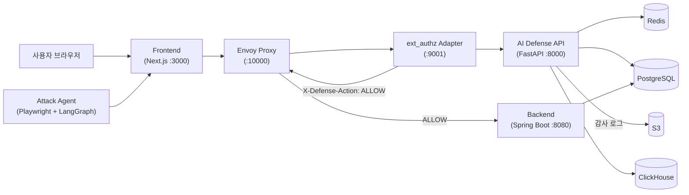
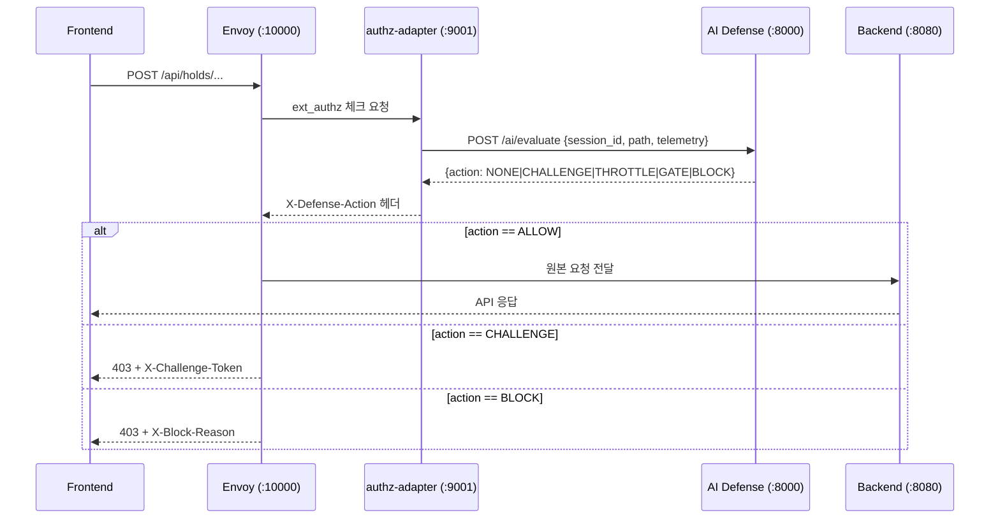
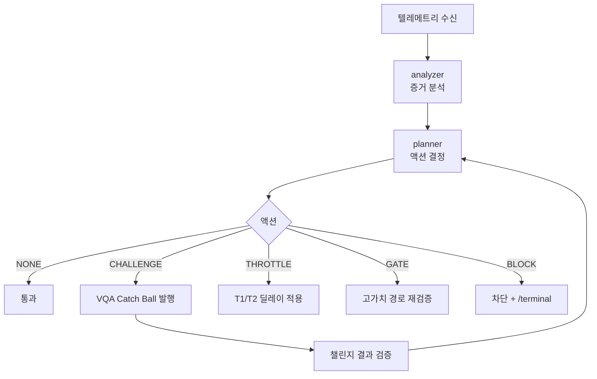

# Traffic Master AI Monorepo

실시간 티켓팅 플랫폼과 AI 기반 보안 방어 시스템을 함께 개발하는 모노레포입니다.  
프론트엔드, 백엔드, Envoy 프록시, AI Defense Runtime, 공격 에이전트를 하나의 레포에서 실행할 수 있습니다.

---

## Developers

|                                        AI                                         |                                        AI                                         |
|:-----------------------------------------------------------------------------------:|:-----------------------------------------------------------------------------------:|
|                                      |                                     |
| 장지현 <br/> [@wkdwlgus](https://github.com/wkdwlgus)                               | 최동훈 <br/> [@DDong-Gosu](https://github.com/DDong-Gosu)                            |

---

## 서비스 구조 / 모듈 구조

이 레포는 4개의 주요 모듈로 구성됩니다.

| 모듈 | 경로 | 언어 / 프레임워크 | 역할 |
|------|------|-------------------|------|
| Frontend | `platform/frontend/` | Next.js 16 / React 19 / TypeScript | 사용자 티켓팅 UI |
| Backend | `platform/backend/` | Spring Boot 3.4.2 / Java 21 | 큐·좌석·결제 API |
| AI Defense | `src/traffic_master_ai/defense/` | FastAPI / Python 3.12 | 온라인 위협 판단 + 오프라인 정책 최적화 |
| Attack Agent | `src/traffic_master_ai/attack/` | Playwright + LangGraph | 공격 시뮬레이션 (테스트용) |
| Pilot (로컬 환경) | `pilot/istio_adapter_local/` | Envoy + FastAPI | 프록시 + ext_authz 어댑터 로컬 스택 |

```text
201-goormgb-ai-1/
├── platform/
│   ├── frontend/                         # Next.js 앱 (포트 3000)
│   └── backend/                          # Spring Boot 백엔드 (포트 8080)
├── pilot/
│   └── istio_adapter_local/              # Envoy(10000) + authz-adapter(9001) + ai-defense(8000) 로컬 파일럿
│       ├── docker-compose.yml
│       ├── envoy/envoy.yaml
│       ├── adapter/                      # ext_authz FastAPI 어댑터
│       ├── pilot_up.sh / pilot_down.sh / pilot_check.sh
│       └── pilot_step*.sh                # 단계별 E2E 테스트
├── src/traffic_master_ai/
│   ├── common/                           # 공통 이벤트·상태 모델
│   ├── defense/
│   │   ├── api/                          # AI Defense API 진입점
│   │   ├── d0_mvp/                       # 온라인 의사결정 엔진
│   │   │   ├── brain/                    # analyzer, planner, guard, turnstile
│   │   │   ├── actuators/                # challenge, throttle, block
│   │   │   ├── state/                    # session_state, redis_client
│   │   │   ├── policy/                   # YAML 정책 로더·스냅샷
│   │   │   ├── optimizer/                # 오프라인 정책 최적화 워커
│   │   │   └── observability/            # audit_logger, collector, warehouse
│   │   └── backoffice_copilot/           # LangGraph 기반 오프라인 AI 리뷰
│   │       ├── workflow/
│   │       ├── storage/                  # ClickHouse + PostgreSQL
│   │       └── analysis/
│   └── attack/
│       ├── a1_mvp/                       # Playwright 기반 공격 에이전트
│       │   ├── browser/
│       │   ├── graph/                    # LangGraph 에이전트
│       │   └── security/                 # catch_ball.py (VQA 해결기)
│       └── a0_poc/                       # 레거시 PoC
├── scripts/                              # Step4/7 검증 스크립트
├── tests/                                # Python 테스트 (30+)
├── spec/aligned_docs_2026-03-10/         # 방어·공격·정합성 설계 문서
├── logs/                                 # 런타임 감사 로그 (JSONL)
├── pyproject.toml
└── .env.ai.example
```

---

## 프로젝트 아키텍처



> Backend는 외부 DB 없이 인메모리 저장소로 동작합니다 (build.gradle에 JPA/DB 의존성 없음).  
> Redis는 `CI=true` 설정 시 인메모리 폴백으로 대체됩니다.

---

## 요청 흐름

### 일반 API 요청 흐름



### 의사결정 액션 분류

| 액션 | 설명 |
|------|------|
| `NONE` | 통과 |
| `CHALLENGE` | VQA Catch Ball 챌린지 요구 |
| `THROTTLE` | 속도 제한 (T1: 200ms / T2: 1800ms) |
| `GATE` | 고가치 경로 VQA 재요구 |
| `BLOCK` | 완전 차단, `/terminal`로 종단 처리 |

### 인증 흐름

- **사용자 인증**: 레포 내 JWT 발급 로직은 확인되지 않음 (`확인 필요`). Backend는 `X-Defense-Action` 헤더를 통해 Envoy로부터 방어 결과를 수신합니다.
- **내부 API 인증**: AI Defense API는 `INTERNAL_API_KEY` 헤더로 authz-adapter와 인증합니다.
- **Turnstile**: Cloudflare Turnstile 사전 검증 (`TM_TURNSTILE_SECRET_KEY`)을 거쳐 챌린지를 발행합니다.

---

## 기술 스택

### Backend (Spring Boot)

| 항목 | 버전 / 라이브러리 |
|------|------------------|
| Language | Java 21 |
| Framework | Spring Boot 3.4.2 |
| Web | spring-boot-starter-web |
| Validation | spring-boot-starter-validation |
| 직렬화 | Jackson + jackson-datatype-jsr310 |
| 코드 생성 | Lombok |
| DB | 없음 (인메모리, build.gradle 기준) |
| 테스트 | JUnit 5 (spring-boot-starter-test) |

### Frontend

| 항목 | 버전 |
|------|------|
| Framework | Next.js 16.1.6 (App Router) |
| Language | TypeScript 5 |
| UI | React 19.2.3 + TailwindCSS 4 + shadcn |
| 상태 관리 | Zustand 5 |
| HTTP | Axios 1.x |
| 컴포넌트 | Radix UI, lucide-react |

### AI Defense / Python

| 항목 | 버전 / 라이브러리 |
|------|------------------|
| Language | Python 3.12+ |
| API 서버 | FastAPI 0.115+ / Uvicorn 0.30+ |
| 캐시 / 세션 상태 | Redis 5+ (인메모리 폴백 지원) |
| ORM / DB | SQLAlchemy 2+ / PostgreSQL (psycopg 3) |
| 분석 DB | ClickHouse (backoffice copilot) |
| 오브젝트 스토리지 | S3 (boto3) |
| AI 워크플로우 | LangGraph 1.0+ |
| LLM | OpenAI API (backoffice copilot) |
| 브라우저 자동화 | Playwright 1.42+ |
| 인증 | PyJWT 2.9+ |
| 모니터링 | OpenTelemetry SDK 1.27+ / Prometheus |
| 추적 | LangSmith |
| 로깅 | python-json-logger |
| 빌드 | Hatchling / pyproject.toml |
| 테스트 | pytest 8+ |
| 린팅 | ruff / mypy (strict) |

### Infra / DevOps

| 항목 | 내용 |
|------|------|
| 프록시 | Envoy (ext_authz 연동) |
| 컨테이너 | Docker / Docker Compose |
| CI/CD | GitHub Actions (4개 워크플로우) |
| 이슈 추적 연동 | JIRA (jira-pr-sync.yml) |

---

## 핵심 비즈니스 흐름

### 티켓 예약 흐름

```mermaid
flowchart TD
  A[경기 목록 조회] --> B[큐 입장\n/api/queue/]
  B --> C[좌석 선택\n/api/seats/]
  C --> D[좌석 홀드\n/api/holds/]
  D --> E[결제\n/api/payments/]
  E --> F{결제 완료}
  F -->|성공| G[예약 확정\n/api/bookings/]
  F -->|방어 차단| H[/terminal 종단 페이지]
```

### AI Defense 의사결정 흐름 (D0 MVP)



### Backoffice Copilot 오프라인 리뷰 흐름

```
감사 로그 (JSONL) → ETL 워커 → ClickHouse 저장
                    → LangGraph 워크플로우
                      → 세션 분석 → 정책 후보 생성
                      → LLM 리뷰 (OpenAI API)
                      → 정책 rollout (policy_operations)
```

---

## 주요 기능

### Backend 컨트롤러 목록

| 컨트롤러 | 주요 엔드포인트 |
|---------|----------------|
| GameController | 경기 정보 조회 |
| QueueController | 큐 입장 / 관리 |
| HoldController | 좌석 홀드 / 릴리스 |
| SeatController | 좌석 선택 / 추천 |
| OrderController | 주문 생성 / 조회 |
| PaymentController | 결제 처리 |
| BookingController | 예약 확정 |
| SecurityController | 보안 챌린지 (`/api/security/challenge`, `/api/security/verify`) |
| SessionController | 세션 관리 |
| TelemetryController | 텔레메트리 수집 |
| LogController | 로그 조회 |
| RecommendationController | 게임별 좌석 추천 |

### AI Defense API 엔드포인트

| 경로 | 설명 |
|------|------|
| `POST /ai/evaluate` | 온라인 위협 판단 (메인 의사결정) |
| `POST /ai/challenge/start` | 챌린지 발행 |
| `POST /ai/challenge/verify` | 챌린지 결과 검증 |
| `POST /ai/precheck` | Cloudflare Turnstile 사전 검증 |
| `POST /ai/telemetry/ingest` | 텔레메트리 수집 |
| `GET /healthz` | 헬스체크 |
| `GET /metrics` | Prometheus 메트릭 |

### VQA Catch Ball

Catch Ball 미니게임은 보안 관문으로 사용됩니다.

- 프론트가 게임 UI를 표시하고 플레이 텔레메트리를 생성합니다.
- `/ai/challenge/verify`로 결과와 텔레메트리를 전달합니다.
- AI Defense Runtime이 속도·점프·타이밍 등 물리 이벤트를 검증합니다.
- `BLOCK` 판정 시 프론트는 `/terminal`로 전환하며 재시도하지 않습니다.

```text
관련 파일:
platform/frontend/src/components/security/CatchBallVqaDemo.tsx
platform/frontend/src/stores/useSecurityStore.ts
src/traffic_master_ai/defense/d0_mvp/api/challenge_api.py
src/traffic_master_ai/defense/d0_mvp/actuators/challenge.py
src/traffic_master_ai/attack/a1_mvp/security/catch_ball.py  # 공격 에이전트용 해결기
```

---

## 실행 가이드

### 사전 준비

| 도구 | 버전 |
|------|------|
| Python | 3.12+ |
| Node.js | 20+ |
| Java | 21 |
| Docker / Docker Compose | 최신 |

### 최초 1회 설치

```bash
# 프로젝트 루트에서
python -m venv .venv
source .venv/bin/activate
pip install -e ".[dev,attack_mvp,defense_api]"

# 프론트엔드 의존성
cd platform/frontend
npm install
```

Playwright 브라우저 설치 (공격 에이전트 실행 시 필요):

```bash
source .venv/bin/activate
playwright install chromium
```

환경 변수 설정:

```bash
cp .env.ai.example .env.ai
# .env.ai 파일을 열어 필요한 값 입력 (아래 "데이터/인프라 의존성" 참고)
set -a; source .env.ai; set +a
```

### 방법 A (권장): 원클릭 기동

`pilot_up.sh`가 Backend / Frontend / Envoy / Adapter / AI Defense를 모두 기동합니다.

```bash
cd pilot/istio_adapter_local
./pilot_up.sh
./pilot_check.sh   # 헬스체크
```

중지:

```bash
./pilot_down.sh
```

### 방법 B: 수동 기동 (터미널 3개)

**1) Backend (포트 8080)**

```bash
cd platform/backend
./gradlew bootRun --console=plain
```

**2) Envoy + Adapter + AI Defense (포트 10000 / 9001 / 8000)**

```bash
cd pilot/istio_adapter_local
docker-compose up -d --build
```

**3) Frontend (포트 3000, API를 Envoy로)**

```bash
cd platform/frontend
TM_API_PROXY_TARGET=http://localhost:10000 npm run dev
```

### 방법 C: AI Defense 단독 실행 (디버깅용)

```bash
source .venv/bin/activate
python -m uvicorn traffic_master_ai.defense.api.main:app \
  --host 0.0.0.0 --port 8000 --reload
```

### 헬스체크

```bash
curl -sS http://localhost:8000/healthz
curl -sS http://localhost:9001/healthz
curl -sS http://localhost:9901/server_info    # Envoy 관리 포트
curl -sS http://localhost:10000/api/games/game-001 | jq .
```

### 테스트

```bash
# Python 테스트
source .venv/bin/activate
pytest

# Backend 테스트
cd platform/backend
./gradlew test
```

### 공격 에이전트 실행

서버가 모두 기동된 상태에서 실행합니다.

```bash
source .venv/bin/activate

# PASS 시나리오 (챌린지 정상 통과)
TM_FRONTEND_URL=http://localhost:3000 \
python -m traffic_master_ai.attack.a1_mvp.main \
  --mode MAP \
  --challenge-mode pass \
  --challenge-strategy ui_solver

# FAIL 시나리오 (봇 패턴으로 실패 유도)
TM_FRONTEND_URL=http://localhost:3000 \
python -m traffic_master_ai.attack.a1_mvp.main \
  --mode MAP \
  --challenge-mode fail \
  --challenge-strategy botlike_fail

# Dry-run (환경 점검)
python -m traffic_master_ai.attack.a1_mvp.main --dry-run
```

### E2E 검증 스크립트

```bash
# Step4 end-to-end 검증
cd pilot/istio_adapter_local
TM_FRONTEND_URL=http://localhost:3000 ./pilot_step4_all.sh

# Step7 공격 모드 매트릭스
cd ../..
python scripts/step7_attack_mode_matrix.py --frontend-url http://localhost:3000
```
---

## 데이터/인프라 의존성

| 항목 | 기본값 | 필수 여부 |
|------|--------|----------|
| Redis | `redis://localhost:6379/0` | 선택 (CI=true 시 인메모리 폴백) |
| PostgreSQL | `TM_PG_URL` | 선택 (`확인 필요`) |
| ClickHouse | 별도 설정 | 백오피스 copilot 사용 시 필요 |
| S3 | `TM_S3_BUCKET` | 선택 (감사 로그 장기 보관) |
| OpenAI API | `TM_OFFLINE_LLM_API_KEY` | 백오피스 copilot 사용 시 필요 |
| Cloudflare Turnstile | `TM_TURNSTILE_SECRET_KEY` | Turnstile 사전검증 사용 시 |
| LangSmith | `LANGSMITH_API_KEY` | 추적 사용 시 |
| OpenTelemetry Collector | `OTEL_EXPORTER_OTLP_ENDPOINT` | 선택 |

### 로그/산출물

```text
logs/attack_mvp/*.jsonl                         # 공격 에이전트 런 로그
logs/step4/*.json                               # Step4 회귀/지표 산출물
platform/backend/logs/decision_audit.jsonl      # 백엔드 감사 로그
platform/backend/logs/trajectory_raw.jsonl      # 원시 궤적 로그
```

---

## 보안/인증 규칙

### ext_authz 요청 헤더 (Envoy → authz-adapter → AI Defense)

| 헤더 | 내용 |
|------|------|
| `X-Defense-Action` | 의사결정 결과 (NONE / CHALLENGE / THROTTLE / GATE / BLOCK) |
| `X-Block-Reason` | 차단 사유 |
| `X-Challenge-Token` | 챌린지 토큰 |

> 커스텀 헤더 정의: `platform/backend/src/main/java/com/trafficmaster/contract/TmHeaders.java`

### AI Defense 내부 인증

- ext_authz 어댑터와 AI Defense API 간 인증: `INTERNAL_API_KEY` 헤더
- Cloudflare Turnstile: 사전 검증 단계에서 `TM_TURNSTILE_SECRET_KEY`로 서버 측 검증
- 챌린지 서명: `TM_CHALLENGE_SECRET`으로 토큰 발행/검증 (`PyJWT`)

### 정책 버전

- 현재 정책 버전: `def-pol-2.0.0` (`TM_DEFENSE_POLICY_VERSION`)
- YAML 정책 파일은 `d0_mvp/policy/loader.py`가 로드하며, Backoffice Copilot 오프라인 워크플로우를 통해 갱신됩니다.

---

## 커밋 메시지 규칙

### 형식

```
<type>: <제목> (50자 이내, 명령문, 마침표 없음)

<본문> (각 행 72자 이내, 무엇을 작업했는지 설명)
```

### 타입 분류

| 타입 | 설명 |
|------|------|
| `feat` | 새 기능 추가 |
| `fix` | 버그 수정 |
| `refactor` | 기능 변경 없는 코드 구조 개선 |
| `test` | 테스트 추가 / 수정 |
| `docs` | 문서 작성 / 수정 |
| `chore` | 빌드, 설정, 의존성 변경 |
| `style` | 포맷·공백 등 코드 스타일만 변경 |
| `perf` | 성능 개선 |
| `ci` | CI/CD 설정 변경 |

### 예시

```
feat(post-review): 윈도우 요약 입력에 완화 증거 추가

- backoffice_copilot의 window_summary 생성 시 실제 완화 증거를 포함하도록 변경
- 기존에는 빈 리스트가 전달되어 LLM 판단 정확도가 낮았던 문제 해결
```

---

## PR 작성 규칙

### PR 제목 형식

```
<type>(<scope>): <작업 요약>
```

### PR 본문 구성

```markdown
## 작업 내용
- 이 PR에서 한 일 목록

## 구현 상세
- 핵심 변경 사항과 그 의도

## 관련 이슈
- Closes #이슈번호 또는 JIRA 티켓

## 테스트 방법
- [ ] 로컬 실행 방법 또는 테스트 명령어

## 참고 사항
- 리뷰어가 알아야 할 추가 맥락
```

### 예시 (백엔드)

```markdown
## 작업 내용
- D0 플래너에서 THROTTLE 후보 게이팅 조건을 완화하여 챌린지 컨텍스트도 포함

## 구현 상세
- `planner.py`의 `_should_throttle` 조건에 `challenge_context` 체크 추가
- 기존에는 단순 반복 패턴만 체크하여 챌린지 후 재시도 봇을 탐지하지 못했음

## 관련 이슈
- Closes TM-412

## 테스트 방법
- [ ] `pytest tests/defense/test_brain_logic.py`
- [ ] Step4 회귀: `./pilot/istio_adapter_local/pilot_step4_all.sh`
```

---

## PR 승인 규칙

코드 리뷰는 잘못 찾기가 아니라 지식 공유와 품질 향상 과정입니다.

### 기본 규칙

- PR 병합 전 최소 **1명 Approve** 필요
- 긴급 hotfix의 경우 팀 합의 하에 예외 가능

### 리뷰 포인트

- 의도한 동작과 코드가 일치하는지
- 테스트가 실제 시나리오를 커버하는지
- 보안 관련 변경(정책·챌린지·헤더)은 특히 꼼꼼하게 확인
- 도메인 외 리뷰어 1명 포함을 권장합니다 (AI Defense ↔ Platform 간 교차 리뷰)

### 참고 문서

| 문서 | 경로 |
|------|------|
| 방어 런타임 설계 | `spec/aligned_docs_2026-03-10/01_defense_runtime_online.md` |
| 공격 에이전트 설계 | `spec/aligned_docs_2026-03-10/02_attack_agent.md` |
| 공격-방어 정합성 매트릭스 | `spec/aligned_docs_2026-03-10/03_attack_defense_alignment_matrix.md` |
| AI Defense API README | `src/traffic_master_ai/defense/api/README.md` |
