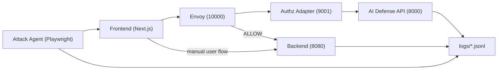

# Traffic Master AI Monorepo

Traffic Master 통합 개발 레포입니다. 이 레포 하나로 아래를 함께 실행할 수 있습니다.

- 플랫폼 프론트엔드(Next.js)
- 플랫폼 백엔드(Spring Boot)
- 로컬 프록시 경로(Envoy + ext_authz Adapter)
- AI Defense Runtime(FastAPI, D0 MVP)
- Attack Agent(A1 MVP, Playwright)

핵심 패키지:
- Python package: `traffic_master_ai`

## 1. 레포 구성

```text
/Users/jangjihyeon/201-goormgb-ai
├── platform/
│   ├── frontend/                         # Next.js 앱
│   └── backend/                          # Spring Boot 백엔드
├── pilot/istio_adapter_local/            # Envoy + ext_authz adapter + ai-defense 로컬 파일럿
├── src/traffic_master_ai/
│   ├── attack/a1_mvp/                    # 공격 에이전트
│   ├── defense/api/                      # AI Defense API 진입점 (v2)
│   └── defense/d0_mvp/                   # D0 MVP 런타임/정책/스펙
├── scripts/                              # Step4/5/7/8 검증 스크립트
├── spec/aligned_docs_2026-03-10/         # 정렬 문서 3종(방어/공격/정합성)
└── tests/                                # 공격/방어 테스트
```

## 2. 아키텍처 개요



## 3. 사전 준비

### 필수

- Python `3.12+`
- Node.js `20+` and npm
- Java `21`
- Docker / Docker Compose

### 최초 1회 설치

```bash
cd /Users/jangjihyeon/201-goormgb-ai
source .venv/bin/activate
pip install -e ".[dev,attack_mvp,defense_api]"

cd /Users/jangjihyeon/201-goormgb-ai/platform/frontend
npm install
```

Playwright 브라우저 설치(공격 에이전트 실행 시 필요):

```bash
source /Users/jangjihyeon/201-goormgb-ai/.venv/bin/activate
playwright install chromium
```

### AI 서버 env 템플릿 준비

```bash
cd /Users/jangjihyeon/201-goormgb-ai
cp .env.ai.example .env.ai
```

클라우드팀 전달 기준:
- AI 서버(방어 런타임)만 배포/운영한다면 `.env.ai` 계열만 전달하면 됩니다.
- Frontend/Backend/Proxy를 같은 팀이 함께 운영한다면 해당 서비스 env도 별도 전달이 필요합니다.

## 4. 전체 서버 기동 방법

아래 2가지 중 하나를 사용합니다.

### 방법 A (권장): 원클릭 기동

`pilot_up.sh`가 백엔드/프론트/Envoy/Adapter/AI를 한 번에 띄웁니다.

```bash
cd /Users/jangjihyeon/201-goormgb-ai/pilot/istio_adapter_local
./pilot_up.sh
./pilot_check.sh
```

중지:

```bash
cd /Users/jangjihyeon/201-goormgb-ai/pilot/istio_adapter_local
./pilot_down.sh
```

### 방법 B: 수동 기동 (터미널 3개)

1) Backend (8080)

```bash
cd /Users/jangjihyeon/201-goormgb-ai/platform/backend
./gradlew bootRun --console=plain
```

2) Envoy + Adapter + AI Defense (10000/9001/8000)

```bash
cd /Users/jangjihyeon/201-goormgb-ai/pilot/istio_adapter_local
docker-compose up -d --build
```

3) Frontend (3000, API를 Envoy로)

```bash
cd /Users/jangjihyeon/201-goormgb-ai/platform/frontend
TM_API_PROXY_TARGET=http://localhost:10000 npm run dev
```

### 방법 C: AI Defense 단독 실행 (디버깅용)

프록시 없이 AI API만 직접 띄워서 `/evaluate`, `/check`, `/docs`를 점검할 때 사용합니다.

```bash
cd /Users/jangjihyeon/201-goormgb-ai
./scripts/run_ai_defense.sh
```

## 5. 헬스체크

```bash
curl -sS http://localhost:8000/healthz
curl -sS http://localhost:9001/healthz
curl -sS http://localhost:9901/server_info
curl -sS http://localhost:10000/api/games/game-001 | jq .
```

## 6. 테스트 방법

### 6.0 전체 켜야 하는 서버 명령어

권장:

```bash
cd /Users/jangjihyeon/201-goormgb-ai/pilot/istio_adapter_local
./pilot_up.sh
./pilot_check.sh
```

### 6.1 직접 유저 테스트 (수동)

1. 브라우저에서 `http://localhost:3000` 접속
2. `game-001` 진입 후 Queue -> Seats -> Hold -> Payment 진행
3. 보안 관문에서 VQA(Catch Ball) 수행
4. 기대 결과
   - 정상 통과 시 결제 완료 페이지 진입
   - 방어 차단 시 `/terminal`로 전환되며 reasonCode 표시

### 6.2 공격 에이전트 테스트

공격 에이전트는 프론트를 실제로 조작하며 티켓팅 흐름을 자동 실행합니다.

PASS 시나리오 예시:

```bash
cd /Users/jangjihyeon/201-goormgb-ai
source .venv/bin/activate
TM_FRONTEND_URL=http://localhost:3000 \
python -m traffic_master_ai.attack.a1_mvp.main \
  --mode MAP \
  --challenge-mode pass \
  --challenge-strategy ui_solver
```

FAIL 시나리오 예시:

```bash
cd /Users/jangjihyeon/201-goormgb-ai
source .venv/bin/activate
TM_FRONTEND_URL=http://localhost:3000 \
python -m traffic_master_ai.attack.a1_mvp.main \
  --mode MAP \
  --challenge-mode fail \
  --challenge-strategy botlike_fail
```

Dry-run(환경 점검):

```bash
cd /Users/jangjihyeon/201-goormgb-ai
source .venv/bin/activate
python -m traffic_master_ai.attack.a1_mvp.main --dry-run
```

## 7. VQA(Catch Ball) 설명

VQA는 S3 고정 보안 관문입니다.

- 프론트는 Catch Ball 미니게임을 표시하고, 플레이 요약 텔레메트리를 생성합니다.
- 검증 요청(`/defense/challenge/verify`)으로 정답/텔레메트리를 전달합니다.
- 방어 런타임은 결과를 반영해 다음 액션을 결정합니다.
- 결과가 `BLOCKED`인 경우 프론트는 챌린지 재시도가 아니라 `/terminal`로 종단 처리됩니다.

관련 코드:

```text
platform/frontend/src/components/security/CatchBallVqaDemo.tsx
platform/frontend/src/stores/useSecurityStore.ts
platform/frontend/src/services/apiClient.ts
platform/frontend/src/app/terminal/page.tsx
src/traffic_master_ai/defense/d0_mvp/api/challenge_api.py
src/traffic_master_ai/defense/d0_mvp/actuators/challenge.py
```

## 8. 로그/산출물

```text
logs/attack_mvp/*.jsonl                         # 공격 에이전트 런 로그
platform/backend/logs/decision_audit.jsonl      # 백엔드 감사 로그
platform/backend/logs/trajectory_raw.jsonl      # 원시 궤적 로그
logs/step4/*.json                               # Step4 회귀/지표 산출물
logs/step5*.json*                               # 오프라인 평가/정책 튜닝 산출물
```

## 9. 자주 쓰는 검증 스크립트

```bash
# Step4 end-to-end
cd /Users/jangjihyeon/201-goormgb-ai/pilot/istio_adapter_local
TM_FRONTEND_URL=http://localhost:3000 ./pilot_step4_all.sh

# Step5 (no key)
cd /Users/jangjihyeon/201-goormgb-ai
./scripts/step5_no_key_all.sh

# Step7 attack matrix
cd /Users/jangjihyeon/201-goormgb-ai
python scripts/step7_attack_mode_matrix.py --frontend-url http://localhost:3000
```

## 10. 트러블슈팅

### 8080 포트 충돌로 backend 기동 실패

```bash
lsof -nP -iTCP:8080 -sTCP:LISTEN
kill -9 <PID>
```

### 3000 포트/Next lock 충돌

```bash
lsof -nP -iTCP:3000 -sTCP:LISTEN
kill -9 <PID>
rm -f /Users/jangjihyeon/201-goormgb-ai/platform/frontend/.next/dev/lock
```

### 프론트가 3001로 올라가 공격 에이전트가 실패

프론트 실제 포트에 맞춰 공격 에이전트 URL을 변경하세요.

```bash
TM_FRONTEND_URL=http://localhost:3001 python -m traffic_master_ai.attack.a1_mvp.main --mode MAP
```

### docker-compose 정리

```bash
cd /Users/jangjihyeon/201-goormgb-ai/pilot/istio_adapter_local
docker-compose down
```

## 11. 개발 문서

- 방어/공격/정합성 3문서:
  - `/Users/jangjihyeon/201-goormgb-ai/spec/aligned_docs_2026-03-10/01_defense_runtime_online.md`
  - `/Users/jangjihyeon/201-goormgb-ai/spec/aligned_docs_2026-03-10/02_attack_agent.md`
  - `/Users/jangjihyeon/201-goormgb-ai/spec/aligned_docs_2026-03-10/03_attack_defense_alignment_matrix.md`

- Defense API:
  - `/Users/jangjihyeon/201-goormgb-ai/src/traffic_master_ai/defense/api/README.md`
