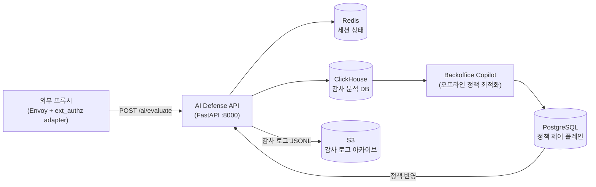
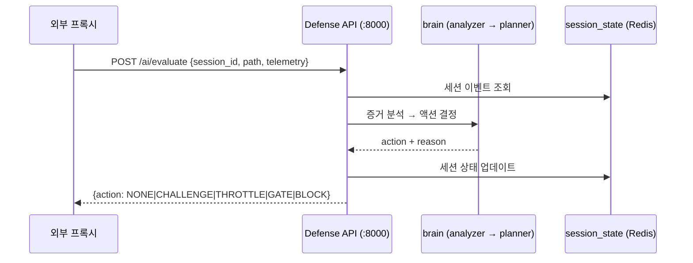

# Traffic Master AI — Defense Runtime

실시간 티켓팅 서비스를 대상으로 하는 **AI 기반 봇 방어 시스템**입니다.  
외부 프록시(Envoy + ext_authz adapter)로부터 요청을 받아 온라인으로 위협을 판단하고, 오프라인으로 정책을 자동 최적화합니다.

> 이 레포의 핵심 기여 범위는 `src/traffic_master_ai/defense/` 입니다.  
> `platform/`(프론트·백엔드), `pilot/`(Envoy·adapter)는 방어 시스템 로컬 검증용 테스트 스캐폴딩입니다.

---

## Developers

|                                        AI                                         |                                        AI                                         |
|:-----------------------------------------------------------------------------------:|:-----------------------------------------------------------------------------------:|
|                                      |                                     |
| 장지현 <br/> [@wkdwlgus](https://github.com/wkdwlgus)                               | 최동훈 <br/> [@DDong-Gosu](https://github.com/DDong-Gosu)                            |

---

## 모듈 구조

```text
src/traffic_master_ai/defense/
├── api/                          # FastAPI 진입점 (포트 8000)
│   ├── main.py                   # 앱 초기화 (OpenTelemetry, Prometheus, CORS)
│   ├── models.py                 # 요청/응답 스키마
│   ├── challenge_runtime.py      # 챌린지 발행·검증 로직
│   ├── policy.py                 # 정책 로더
│   ├── audit.py                  # JSONL 감사 로거
│   ├── etl_worker.py             # 배경 ETL 워커
│   ├── archive_runtime.py        # S3 감사 로그 아카이브
│   └── settings.py               # 환경 변수 설정
│
├── d0_mvp/                       # 온라인 의사결정 엔진
│   ├── brain/
│   │   ├── analyzer.py           # 세션 이벤트 증거 분석
│   │   ├── planner.py            # 액션 결정 (NONE/CHALLENGE/THROTTLE/GATE/BLOCK)
│   │   ├── guard.py              # 보안 게이트
│   │   └── turnstile.py          # Cloudflare Turnstile 검증
│   ├── actuators/
│   │   ├── challenge.py          # VQA 챌린지 실행
│   │   ├── throttle.py           # 속도 제한 실행
│   │   └── block.py              # 차단 실행
│   ├── state/
│   │   ├── session_state.py      # 세션 상태 (Redis / 인메모리 폴백)
│   │   ├── redis_client.py
│   │   └── block_state.py
│   ├── policy/
│   │   ├── loader.py             # YAML 정책 로드
│   │   └── snapshot.py           # 정책 스냅샷
│   ├── optimizer/                # 오프라인 정책 최적화 워커
│   │   ├── worker.py
│   │   ├── pipeline.py
│   │   └── effect_evaluator.py
│   ├── observability/
│   │   ├── audit_logger.py       # 구조화 감사 로깅
│   │   ├── collector.py
│   │   └── warehouse.py
│   └── events/
│       └── catalog.py            # 이벤트 카탈로그 정의
│
└── backoffice_copilot/           # 오프라인 AI 정책 리뷰 (LangGraph + OpenAI)
    ├── runner.py                 # 진입점 (tm-ai-post-review)
    ├── workflow/                 # LangGraph 워크플로우
    ├── ingest/                   # 감사 로그 수집·해석
    ├── analysis/                 # 세션 분석, 후보 정책 생성
    ├── summary/                  # 윈도우 요약 생성
    ├── review/                   # LLM 리뷰 실행
    ├── output/                   # 정책 Export·Persist
    ├── validation/               # 정책 유효성 검증
    └── storage/                  # ClickHouse + PostgreSQL 저장소
```

---

## 아키텍처

Defense API는 외부 프록시로부터 `POST /ai/evaluate` 요청을 받아 위협을 판단하고 액션을 반환합니다.



> 외부 프록시와의 통신 방식은 `INTERNAL_API_KEY` 헤더로 인증합니다.  
> Redis 없이 실행 시 `CI=true` 환경변수로 인메모리 상태로 폴백합니다.

---

## 요청 흐름

### 온라인 판단 흐름



### 의사결정 액션

| 액션 | 설명 |
|------|------|
| `NONE` | 통과 |
| `CHALLENGE` | VQA Catch Ball 챌린지 요구 |
| `THROTTLE` | 속도 제한 (T1: 200ms / T2: 1800ms) |
| `GATE` | 고가치 경로 VQA 재요구 |
| `BLOCK` | 완전 차단 |

### VQA Catch Ball 챌린지 흐름

1. 클라이언트가 `POST /ai/challenge/start` 호출 → 챌린지 토큰 발행
2. 클라이언트가 Catch Ball 미니게임 수행 후 플레이 텔레메트리 수집
3. `POST /ai/challenge/verify` 로 결과 + 텔레메트리 전달
4. Defense Runtime이 속도·점프·타이밍 등 물리 이벤트 검증
5. 검증 결과를 다음 `/ai/evaluate` 판단에 반영

```text
관련 코드:
src/traffic_master_ai/defense/api/challenge_runtime.py
src/traffic_master_ai/defense/d0_mvp/actuators/challenge.py
src/traffic_master_ai/defense/d0_mvp/brain/guard.py
```

### 오프라인 정책 최적화 흐름 (Backoffice Copilot)

```text
감사 로그 (JSONL)
  → ETL 워커 (etl_worker.py)
  → ClickHouse 적재
  → LangGraph 워크플로우 실행
      → ingest: 감사 로그 해석
      → analysis: 세션 분석 + 정책 후보 생성
      → summary: 윈도우 요약
      → review: LLM 리뷰 (OpenAI API)
      → output: 정책 검증 + PostgreSQL 저장
  → 정책 제어 플레인 반영
```

---

## 기술 스택

| 항목 | 버전 / 라이브러리 |
|------|------------------|
| Language | Python 3.12+ |
| API 서버 | FastAPI 0.115+ / Uvicorn 0.30+ |
| 세션 상태 | Redis 5+ (인메모리 폴백 지원) |
| ORM / DB | SQLAlchemy 2+ / PostgreSQL (psycopg 3) |
| 감사 분석 DB | ClickHouse |
| 오브젝트 스토리지 | S3 (boto3) |
| AI 워크플로우 | LangGraph 1.0+ |
| LLM | OpenAI API (backoffice copilot) |
| 인증 | PyJWT 2.9+ |
| 모니터링 | OpenTelemetry SDK 1.27+ / Prometheus |
| 추적 | LangSmith |
| 로깅 | python-json-logger (JSON 구조화 로깅) |
| 빌드 | Hatchling / pyproject.toml |
| 테스트 | pytest 8+ |
| 린팅 | ruff / mypy (strict) |

---

## API 엔드포인트

| 경로 | 설명 |
|------|------|
| `POST /ai/evaluate` | 온라인 위협 판단 (메인 의사결정) |
| `POST /ai/challenge/start` | VQA 챌린지 발행 |
| `POST /ai/challenge/verify` | 챌린지 결과 검증 |
| `POST /ai/precheck` | Cloudflare Turnstile 사전 검증 |
| `POST /ai/telemetry/ingest` | 텔레메트리 수집 |
| `GET /healthz` | 헬스체크 |
| `GET /metrics` | Prometheus 메트릭 |

---

## 실행 가이드

### 사전 준비

| 도구 | 버전 |
|------|------|
| Python | 3.12+ |
| Docker | 최신 (Redis 로컬 실행 시) |

### 최초 1회 설치

```bash
python -m venv .venv
source .venv/bin/activate
pip install -e ".[dev,defense_api]"
```

### Defense API 단독 실행

```bash
source .venv/bin/activate
set -a; source .env.ai; set +a

python -m uvicorn traffic_master_ai.defense.api.main:app \
  --host 0.0.0.0 --port 8000 --reload
```

Redis 없이 인메모리 모드로 실행 (개발/테스트):

```bash
CI=true python -m uvicorn traffic_master_ai.defense.api.main:app \
  --host 0.0.0.0 --port 8000 --reload
```

### 헬스체크

```bash
curl -sS http://localhost:8000/healthz
curl -sS http://localhost:8000/metrics
```

### 테스트

```bash
source .venv/bin/activate
pytest tests/defense/
```

### CLI 스크립트 (pyproject.toml 등록)

| 커맨드 | 설명 |
|--------|------|
| `tm-ai-etl` | 감사 로그 → ClickHouse ETL 실행 |
| `tm-ai-post-review` | Backoffice Copilot 오프라인 리뷰 실행 |
| `tm-ai-policy-optimizer` | 오프라인 정책 최적화 워커 실행 |
| `tm-ai-policy-bootstrap` | 정책 초기값 적재 |
| `tm-ai-storage-migrate` | PostgreSQL 마이그레이션 |
| `tm-ai-clickhouse-migrate` | ClickHouse 마이그레이션 |

---

## 데이터/인프라 의존성

| 항목 | 환경변수 | 필수 여부 |
|------|----------|----------|
| Redis | `TM_REDIS_URL` | 선택 (`CI=true` 시 인메모리 폴백) |
| PostgreSQL | `TM_PG_URL` | Backoffice Copilot 사용 시 필요 |
| ClickHouse | 별도 설정 | Backoffice Copilot 사용 시 필요 |
| S3 | `TM_S3_BUCKET` | 감사 로그 장기 보관 시 |
| OpenAI API | `TM_OFFLINE_LLM_API_KEY` | Backoffice Copilot 사용 시 필요 |
| Cloudflare Turnstile | `TM_TURNSTILE_SECRET_KEY` | Turnstile 사전검증 사용 시 |
| LangSmith | `LANGSMITH_API_KEY` | 추적 사용 시 |
| OpenTelemetry Collector | `OTEL_EXPORTER_OTLP_ENDPOINT` | 선택 |

환경변수 전체 목록: [`.env.ai.example`](.env.ai.example)

### 로그/산출물

```text
logs/defense_decision_audit.jsonl   # 온라인 판단 감사 로그
logs/step4/*.json                   # Step4 회귀/지표 산출물
```

---

## 보안/인증

- **외부 프록시 → Defense API**: `INTERNAL_API_KEY` 헤더로 인증
- **Turnstile 사전검증**: `TM_TURNSTILE_SECRET_KEY`로 Cloudflare 서버 측 검증
- **챌린지 토큰 서명**: `TM_CHALLENGE_SECRET`으로 발행·검증 (`PyJWT`)
- **정책 버전**: `TM_DEFENSE_POLICY_VERSION` (현재 `def-pol-2.0.0`)

---

## 커밋 메시지 규칙

### 형식

```
<type>: <제목> (50자 이내, 명령문, 마침표 없음)

<본문> (각 행 72자 이내, 무엇을 작업했는지 설명)
```

### 타입 분류

| 타입 | 설명 |
|------|------|
| `feat` | 새 기능 추가 |
| `fix` | 버그 수정 |
| `refactor` | 기능 변경 없는 코드 구조 개선 |
| `test` | 테스트 추가 / 수정 |
| `docs` | 문서 작성 / 수정 |
| `chore` | 빌드, 설정, 의존성 변경 |
| `style` | 포맷·공백 등 코드 스타일만 변경 |
| `perf` | 성능 개선 |
| `ci` | CI/CD 설정 변경 |

### 예시

```
feat(post-review): 윈도우 요약 입력에 완화 증거 추가

- backoffice_copilot의 window_summary 생성 시 실제 완화 증거를 포함하도록 변경
- 기존에는 빈 리스트가 전달되어 LLM 판단 정확도가 낮았던 문제 해결
```

---

## PR 작성 규칙

### PR 제목 형식

```
<type>(<scope>): <작업 요약>
```

### PR 본문 구성

```markdown
## 작업 내용
- 이 PR에서 한 일 목록

## 구현 상세
- 핵심 변경 사항과 그 의도

## 관련 이슈
- Closes #이슈번호 또는 JIRA 티켓

## 테스트 방법
- [ ] 로컬 실행 방법 또는 테스트 명령어

## 참고 사항
- 리뷰어가 알아야 할 추가 맥락
```

### 예시

```markdown
## 작업 내용
- D0 플래너에서 THROTTLE 후보 게이팅 조건을 완화하여 챌린지 컨텍스트도 포함

## 구현 상세
- `planner.py`의 `_should_throttle` 조건에 `challenge_context` 체크 추가
- 기존에는 단순 반복 패턴만 체크하여 챌린지 후 재시도 봇을 탐지하지 못했음

## 관련 이슈
- Closes TM-412

## 테스트 방법
- [ ] `pytest tests/defense/test_brain_logic.py`
```

---

## PR 승인 규칙

코드 리뷰는 잘못 찾기가 아니라 지식 공유와 품질 향상 과정입니다.

- PR 병합 전 최소 **1명 Approve** 필요
- 긴급 hotfix의 경우 팀 합의 하에 예외 가능
- 보안 관련 변경(정책·챌린지·헤더)은 반드시 크로스 리뷰

### 참고 문서

| 문서 | 경로 |
|------|------|
| 방어 런타임 설계 | `spec/aligned_docs_2026-03-10/01_defense_runtime_online.md` |
| 공격 에이전트 설계 | `spec/aligned_docs_2026-03-10/02_attack_agent.md` |
| 공격-방어 정합성 매트릭스 | `spec/aligned_docs_2026-03-10/03_attack_defense_alignment_matrix.md` |
