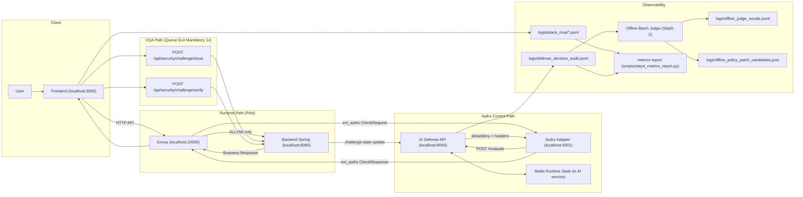

# Local Pilot Architecture (Notion Copy)



## Request Flow (ordered)
1. FE가 API 요청을 Envoy(`:10000`)로 보낸다.
2. Envoy가 Authz Adapter(`:9001`)로 `ext_authz` 체크를 보낸다.
3. Adapter가 AI Defense(`:8000`)의 `/evaluate`를 호출한다.
4. AI Defense가 런타임 상태를 읽고(`Redis state`) allow/deny + `x-defense-*` 헤더를 계산한다.
5. Adapter가 Envoy에 체크 결과를 반환한다.
6. allow면 Envoy가 Backend(`:8080`)로 전달한다.
7. deny면 Envoy가 즉시 403(+`x-defense-*`)를 FE로 반환한다.

## VQA Rule (current lock)
1. 대기열 직후 VQA 1회는 전 세션 필수.
2. FE는 `/api/security/challenge/issue`로 문제를 발급받고, `/api/security/challenge/verify`로 검증한다.
3. 검증 성공 전 고가치 요청은 게이트된다.
4. 검증 실패 누적은 정책에 따라 차단으로 승격된다.

## Offline LLM Path (Step5-2)
1. 런타임 차단/허용은 오프라인 LLM과 분리된다.
2. `logs/defense_decision_audit.jsonl`이 임계 건수 이상이면 배치를 실행한다.
3. 배치는 세션별 판정 결과(JSONL)와 정책 보정 후보(JSON)를 만든다.
4. 정책 보정 후보는 수동 승인 전에는 런타임에 반영하지 않는다.

## Pilot Verification Commands
```bash
cd /Users/jangjihyeon/201-goormgb-ai/pilot/istio_adapter_local
TM_FRONTEND_URL=http://localhost:3000 ./pilot_step4_all.sh
```

## Offline Batch Command
```bash
cd /Users/jangjihyeon/201-goormgb-ai
python scripts/step5_offline_llm_batch.py --min-log-count 1 --mode mock
```
