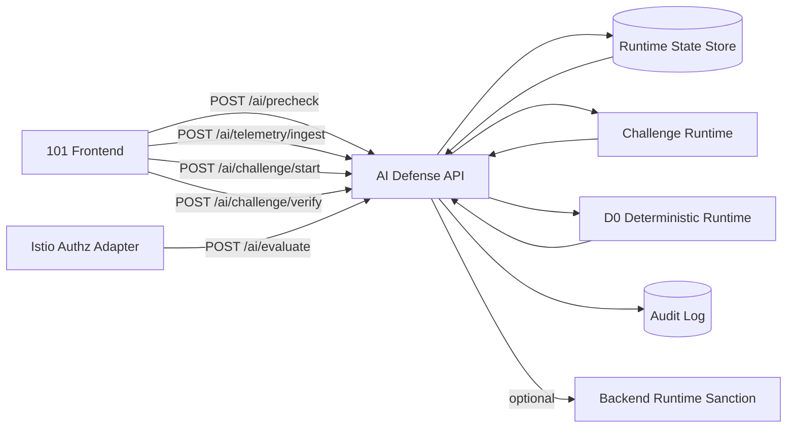

# AI Defense Runtime Diagram (Text Source)

```mermaid
flowchart LR
  FE[101 Frontend] -->|POST /ai/precheck| API[AI Defense API]
  FE -->|POST /ai/telemetry/ingest| API
  FE -->|POST /ai/challenge/start| API
  FE -->|POST /ai/challenge/verify| API

  ADAPTER[Istio Authz Adapter] -->|POST /ai/evaluate| API

  API --> STORE[(Runtime State Store)]
  API --> CHALLENGE[Challenge Runtime]
  API --> D0[D0 Deterministic Runtime]
  API --> AUDIT[(Audit Log)]
  API -->|optional| SANCTION[Backend Runtime Sanction]

  STORE --> API
  CHALLENGE --> API
  D0 --> API
```

## Notes
- State key: `{sid}:{matchId}`
- Public API surface: `/ai/*` only
- Legacy `/challenge/*` path is not part of current public contract
