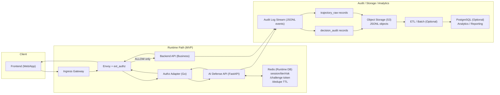
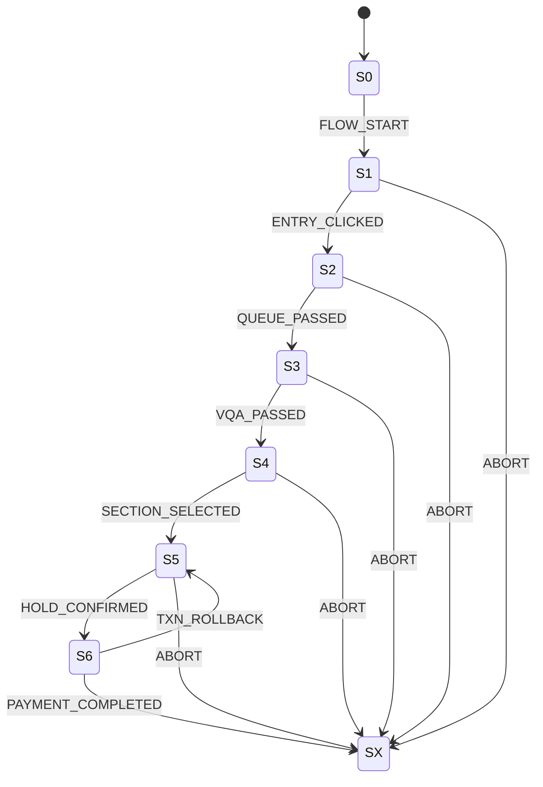

# Defense Runtime (Online + VQA Gate + Offline Optimization)

## 1. 문서 목적과 범위
이 문서는 리팩토링 완료 후 기준의 방어 런타임을 정의합니다. 핵심은 실시간 요청 경로에서 결정적(Deterministic) 정책으로 `allow/deny`를 판단하고, VQA 관문과 상태를 일관되게 관리하는 것입니다. LLM은 런타임 경로가 아니라 사후 최적화 경로에서만 사용합니다.

```yaml
document_scope:
  target: "post-refactor defense runtime v1"
  runtime_goal:
    - "deterministic per-request decision"
    - "stable VQA gate orchestration"
    - "strict state/audit contract"
  includes:
    - "online runtime path"
    - "VQA gate maker/verifier"
    - "offline optimization boundary"
  excludes:
    - "temporary compatibility notes"
    - "legacy code-term migration history"
```

## 2. 시스템 경계와 컴포넌트
실시간 경로는 Ingress/Envoy/ext_authz/Adapter/AI Defense API/Backend로 구성됩니다. 상태 저장은 Redis를 사용하고, 로그는 JSONL 원본으로 적재 후 S3와 PostgreSQL 경로로 분리합니다.

```yaml
components:
  online_path:
    - "Client Frontend"
    - "Ingress Gateway"
    - "Envoy + ext_authz"
    - "Authz Adapter"
    - "AI Defense API"
    - "Backend API"
    - "Redis (runtime state)"
  data_path:
    - "Audit Log Stream"
    - "Object Storage (S3, raw JSONL)"
    - "ETL/Batch"
    - "PostgreSQL (analytics/reporting)"
  ai_runtime_modules:
    - "Guard"
    - "Analyzer"
    - "Planner"
    - "Orchestrator"
```

## 3. 전체 워크플로우
온라인 워크플로우는 요청별 판단 경로이고, VQA 워크플로우는 S3 관문의 발급/검증 경로입니다. 오프라인 워크플로우는 로그 기반 정책 튜닝 경로로 런타임과 분리됩니다.



```yaml
workflow_phases:
  online_runtime:
    - "request intercept"
    - "risk/action decision"
    - "allow/deny enforcement"
    - "runtime state commit"
  vqa_gate:
    - "challenge issue"
    - "event ingest"
    - "verify verdict"
    - "state sync and next decision"
  offline_optimization:
    - "log ingestion"
    - "aggregate and evaluate"
    - "patch proposal"
    - "rollout/rollback"
```

## 4. 상태머신
방어 런타임은 `S0~S6,SX` 상태머신을 따릅니다. `SX`는 종단 상태이며 추가 개입을 금지합니다. `S6`에서는 신규 마찰 개입을 금지하고, 차단만 예외로 허용합니다.



```yaml
state_guardrails:
  terminal_rule:
    when: "flowState == SX"
    then: "no replan, no state mutation"
  payment_stage_rule:
    when: "flowState == S6"
    then: "allow NONE or BLOCK only"
  s3_gate_rule:
    when: "request enters S4/S5 and vqa_passed != true"
    then: "REQUIRE_S3"
```

## 5. 의사결정 엔진
방어 엔진은 Guard→Analyzer→Planner→Orchestrator 파이프라인으로 동작합니다. 각 단계는 책임이 분리되어 있어야 하며, 같은 상태 필드에 대한 writer 충돌을 허용하지 않습니다.

```yaml
decision_engine:
  pipeline_order:
    - Guard
    - Analyzer
    - Planner
    - Orchestrator
  modules:
    Guard:
      role: "risk score + tier calculation"
      writes: ["riskScore", "defenseTier"]
    Analyzer:
      role: "evidence and counter update"
      writes: ["challengeFailCount", "holdFailStreak", "seatTakenStreak"]
    Planner:
      role: "action selection"
      outputs: ["NONE", "THROTTLE", "REQUIRE_S3", "BLOCK"]
    Orchestrator:
      role: "transition validation + response shaping"
      writes: ["flowState", "vqaPassed"]
  dedupe:
    key: "traceId|eventType|time_bucket"
    behavior: "duplicate no-op on score/counter updates"
```

## 6. 실행 액션
액션은 런타임에서 결정하고, 집행은 Adapter/Envoy가 수행합니다. THROTTLE은 허용 응답을 유지하면서 지연을 주고, REQUIRE_S3/BLOCK은 deny로 즉시 응답합니다.

```yaml
runtime_actions:
  NONE:
    allow: true
    enforcement: "pass-through"
  THROTTLE:
    allow: true
    enforcement: "adapter delay injection"
    headers:
      - "x-defense-action=throttle"
      - "x-throttle-ms"
  REQUIRE_S3:
    allow: false
    http: 428
    reasonCode: "CHALLENGE_REQUIRED"
  BLOCK:
    allow: false
    http: 403
    reasonCode: "BLOCKED"

enforcement_points:
  adapter:
    - "delay apply"
    - "forward x-defense-* headers"
  envoy:
    - "deny response compose"
```

## 7. 프로토콜/인터페이스 계약
실시간 판단 API와 VQA API는 명확히 분리합니다. 응답 해석은 `HTTP + reasonCode + x-defense-*` 조합으로 고정합니다.

```yaml
api_contract:
  evaluate:
    method: POST
    path: /evaluate
    response_fields:
      - allow
      - action
      - defense_tier
      - headers_to_add
      - reason
  vqa_gate:
    issue:
      method: POST
      path: /defense/challenge/issue
    ingest:
      method: POST
      path: /defense/challenge/event
    verify:
      method: POST
      path: /defense/challenge/verify

header_contract:
  required_response_headers:
    - x-defense-tier
    - x-defense-action
    - x-defense-policy-version
  optional_response_headers:
    - x-throttle-ms
    - x-challenge-type
    - x-block-reason

reason_http_mapping:
  BLOCKED: 403
  CHALLENGE_REQUIRED: 428
```

## 8. 데이터/저장소 아키텍처
저장소 책임을 온라인/오프라인으로 분리합니다. Redis는 즉시 판단 상태, S3는 원본 로그, PostgreSQL은 ETL 후 구조화 분석 데이터의 저장소입니다.

```yaml
storage_architecture:
  redis_runtime:
    purpose: "real-time decision state"
    stores:
      - "session/tier/risk"
      - "challenge token/state"
      - "dedupe ttl keys"
  s3_object_storage:
    purpose: "raw immutable audit archive"
    stores:
      - "decision_audit.jsonl"
      - "trajectory_raw.jsonl"
  postgresql_analytics:
    purpose: "query/report/tuning evidence"
    stores:
      - "session-level verdict summary"
      - "aggregated metrics"
      - "policy patch proposal/apply history"
```

## 9. 로그/관측성
런타임은 최소 필수 필드를 가진 감사 로그를 남겨야 하며, 추후 오프라인 분석에서 재현 가능한 형태여야 합니다.

```jsonl
{"ts_ms":1772500000000,"event_type":"EVALUATE","session_id":"sess-001","trace_id":"tr-001","flow_state":"S4","defense_tier":"T2","action":"THROTTLE","allow":true,"reason_code":null,"policy_version":"def-pol-v1","headers_to_add":{"x-defense-action":"throttle","x-throttle-ms":"250"}}
{"ts_ms":1772500000320,"event_type":"S3_CHALLENGE_RESULT","session_id":"sess-001","challenge_id":"CH_abc123","payload":{"result":"FAILED","attempts_used":1,"attempts_left":1}}
{"ts_ms":1772500000800,"event_type":"EVALUATE","session_id":"sess-001","trace_id":"tr-002","flow_state":"S4","defense_tier":"T3","action":"BLOCK","allow":false,"reason_code":"BLOCKED","policy_version":"def-pol-v1"}
```

```yaml
observability_kpis:
  runtime:
    - block_rate
    - require_s3_rate
    - throttle_delay_p50_p90
    - challenge_pass_fail_rate
  integrity:
    - dedup_duplicate_rate
    - missing_feature_rate
```

## 10. 실패 처리와 가드레일
보안과 UX를 같이 만족하려면 장애 경계와 정책 가드레일을 고정해야 합니다. 특히 결제 단계(S6)와 종단 상태(SX) 규칙은 절대 깨지면 안 됩니다.

```yaml
failure_and_guardrails:
  s6_rule:
    constraint: "no new friction except BLOCK"
  terminal_rule:
    constraint: "no mutation after SX"
  challenge_service_failure:
    behavior: "policy-defined fail-open/close boundary"
  adapter_to_ai_timeout:
    behavior: "explicit fallback + audit"
  block_persistence:
    behavior: "terminal-first read before re-evaluation"
```

## 11. 검증 시나리오
검증은 기능 테스트가 아니라 계약 테스트로 정의합니다. 각 케이스는 요청 입력, 기대 응답, 기대 상태, 기대 로그를 동시에 검증해야 합니다.

```yaml
validation_scenarios:
  - id: DR-01
    case: "S4/S5 with vqa_passed=false"
    expect:
      http: 428
      reasonCode: CHALLENGE_REQUIRED
      header_action: REQUIRE_S3
  - id: DR-02
    case: "tier=T2 read request"
    expect:
      allow: true
      header_action: THROTTLE
      throttle_ms: ">=1"
  - id: DR-03
    case: "challenge fail threshold reached"
    expect:
      http: 403
      reasonCode: BLOCKED
      state_flow: SX
  - id: DR-04
    case: "flowState=S6 non-block condition"
    expect:
      action_in: [NONE]
      no_new_challenge: true
  - id: DR-05
    case: "duplicate event"
    expect:
      risk_counter_update: "no-op"
      audit_dedup_flag: true
```

## 12. 운영 체크리스트
운영 시작 전에는 정책/저장소/관측성/가드레일을 함께 점검해야 합니다. 단일 항목만 통과해도 배포 가능한 구조로 보지 않습니다.

```yaml
ops_checklist:
  pre_deploy:
    - "action enum and reasonCode contract locked"
    - "Redis TTL/key schema verified"
    - "S3 raw log path and retention configured"
    - "PostgreSQL ETL job contract validated"
    - "x-defense-* headers verified on Envoy/Adapter path"
    - "S6/SX guardrail tests green"
    - "audit required fields completeness >= 99.9%"
  post_deploy:
    - "block/challenge/throttle KPI dashboard healthy"
    - "offline optimization pipeline isolated from runtime latency"
```
