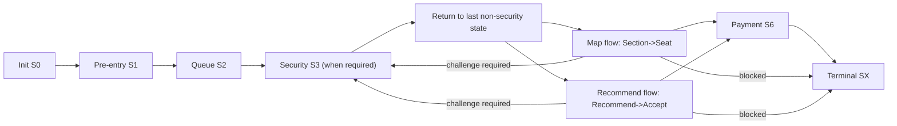
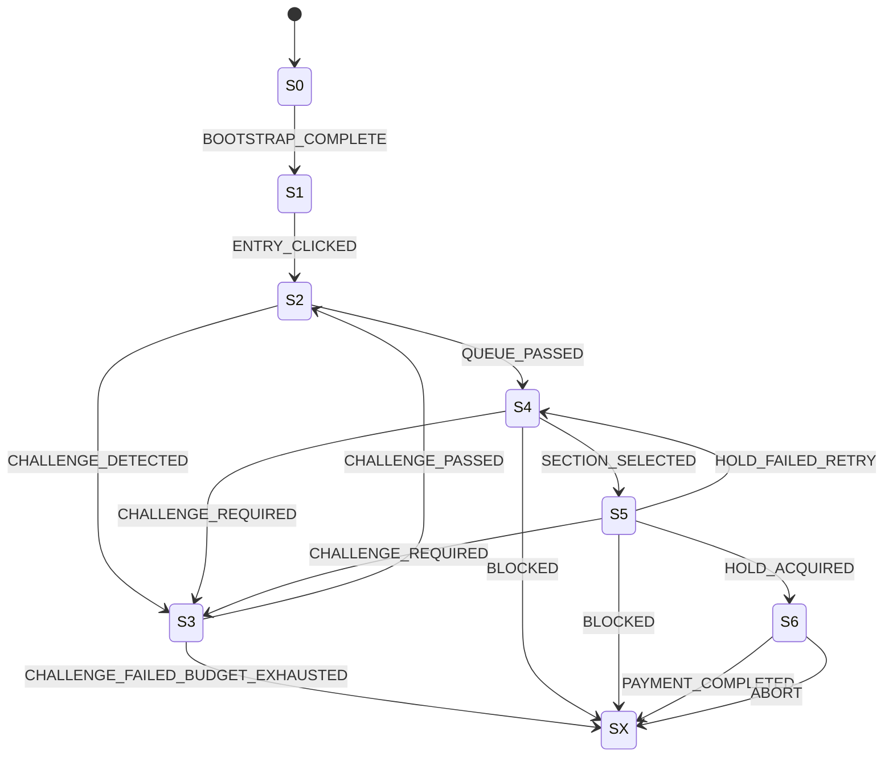

# Attack Agent (Mode + VQA Solver)

## 1. 문서 목적과 범위
이 문서는 방어 검증용 공격 에이전트의 실행 모델을 정의합니다. 목표는 실서비스 침해가 아니라, 방어 정책의 반응과 한계를 재현 가능한 방식으로 검증하는 것입니다.

```yaml
document_scope:
  target: "post-refactor attack agent v1"
  objective:
    - "reproducible adversarial traffic generation"
    - "defense contract validation under mode/strategy matrix"
  includes:
    - "state-driven booking workflow"
    - "challenge solver strategies"
    - "defense response interpretation"
  excludes:
    - "production abuse automation"
    - "manual penetration operations"
```

## 2. 시스템 경계와 컴포넌트
공격 에이전트는 Control/Task/Execution 계층으로 분리됩니다. 런너가 상태를 관리하고, 그래프 노드가 단계별 행동을 수행하며, 브라우저 워커가 실제 UI/API 상호작용을 실행합니다.

```yaml
components:
  control_plane:
    - "Agent Runner"
    - "State Machine Router"
    - "Mode/Strategy Config"
  task_plane:
    - "Pre-entry node"
    - "Queue node"
    - "Security(VQA) node"
    - "Section/Seat/Payment nodes"
  execution_plane:
    - "Browser Worker (Playwright)"
    - "API request hooks"
    - "Audit Logger"
  external_dependencies:
    - "Frontend app"
    - "Backend security APIs"
    - "Defense runtime (via ext_authz path)"
```

## 3. 전체 워크플로우
워크플로우는 상태 기반으로 진행되며, 보안 오버레이가 감지되면 S3 보안 노드로 인터럽트 진입합니다. 챌린지 통과 후 마지막 비보안 상태로 복귀합니다.



```yaml
workflow_modes:
  MAP:
    path: [S0, S1, S2, S4, S5, S6, SX]
  RECOMMEND:
    path: [S0, S1, S2, S4, S5, S6, SX]
    note: "recommend subflow is internal branch, top-level enum stays S4/S5"

security_interrupt:
  trigger: "security overlay visible OR CHALLENGE_REQUIRED response"
  transition: "S* -> S3"
  resume: "S3 passed -> last_non_security_state"
```

## 4. 상태머신
상태머신은 `S0~S6,SX` 고정 enum을 사용합니다. 실패는 예산/정책 기준으로 재시도하거나 종단(SX)으로 전이됩니다.



```yaml
state_contract:
  enum: [S0, S1, S2, S3, S4, S5, S6, SX]
  terminal_reason_enum:
    - DONE
    - ABORT
    - COOLDOWN
    - RESET
    - SESSION_EXPIRED
    - BLOCKED
  counters:
    - challenge_failed
    - seat_taken
    - hold_failed
    - payment_failed
```

## 5. 의사결정 엔진
공격 에이전트의 의사결정은 정책 추론 모델이 아니라, 상태 라우팅 + 전략 선택 + 방어 응답 해석 조합으로 동작합니다.

```yaml
decision_engine:
  route_selector:
    input: flow_state
    output: node_name
  challenge_strategy_selector:
    inputs:
      - challenge_mode  # auto|pass|fail
      - challenge_strategy
    output: solver_path
  defense_response_interpreter:
    blocked_if:
      - "http_status == 403"
      - "reasonCode == BLOCKED"
    challenge_if:
      - "http_status == 428"
      - "reasonCode == CHALLENGE_REQUIRED"
  mode_router:
    MAP: "section->seat path"
    RECOMMEND: "recommend->accept path"
```

## 6. 실행 액션
실행 액션은 상태 노드에서 UI/API 행위를 수행하고, 방어 응답에 따라 재시도/전이/종료를 결정합니다. VQA 솔버는 API 모드와 UI 모드를 모두 지원합니다.

VQA Solver는 두 계층으로 동작합니다.  
`api_solver`는 챌린지 발급/검증 API를 직접 호출해 PASS/FAIL 시나리오를 재현합니다. 여기서 `api_fast`, `humanish_pass`, `edge_pass`는 통과 가능한 텔레메트리 payload를, `botlike_fail`, `timing_fail`, `token_tamper`는 실패/차단을 유도하는 payload를 만듭니다.

`ui_solver`는 실제 화면 오버레이를 보고 상호작용합니다. 시작 버튼 클릭 -> 글러브 드래그 -> 타이밍 윈도우 진입 시 캐치 클릭 순서로 진행하며, 실패 시 재시도 버튼을 눌러 라운드를 반복합니다. 즉 단순 API 위조가 아니라, 브라우저 입력 이벤트 체인을 통해 프론트 센서 계층까지 통과하려는 전략입니다.

사람형 모사는 `BrowserWorker`의 궤적 생성에서 구현됩니다.  
직선 이동 대신 cubic-bezier 곡선과 수직 방향 가우시안 노이즈를 섞고, `ease-in-out` 속도 프로파일과 dwell time(클릭 전 머무름)을 적용합니다. 이 과정에서 `linearity_ratio`, `tremor_std_dev`, `avg_velocity`, `dwell_time_ms`를 계산해 목표 분포와 얼마나 비슷한지 추적합니다.

```yaml
attack_actions:
  normal_flow:
    - "navigate"
    - "click/select"
    - "wait response"
    - "transition update"
  challenge_flow:
    api_solver:
      strategies:
        - api_fast
        - humanish_pass
        - edge_pass
        - botlike_fail
        - timing_fail
        - token_tamper
    ui_solver:
      strategies:
        - ui_solver
        - ui_solver_stealth
      behavior:
        - "detect target/glove"
        - "drag path generation"
        - "timing-window sync click"
  terminal_actions:
    - "abort"
    - "blocked"
    - "done"
```

## 7. 프로토콜/인터페이스 계약
공격 에이전트는 방어 응답을 계약 기반으로 해석합니다. HTTP 상태코드와 reasonCode가 불일치하는 경우를 포함해 보수적으로 판정합니다.

```yaml
protocol_contract:
  defense_response:
    blocked:
      http: 403
      reasonCode: BLOCKED
    challenge_required:
      http: 428
      reasonCode: CHALLENGE_REQUIRED
    challenge_unavailable:
      http: 503
      reasonCode: CHALLENGE_VERIFY_UNAVAILABLE
  consumed_headers:
    - x-defense-action
    - x-defense-tier
    - x-defense-policy-version
    - x-defense-throttle-ms

challenge_api_contract:
  issue:
    method: GET
    path: /api/security/challenge
    required_fields:
      - challengeId
      - challengeToken
      - attemptLimit
  verify:
    method: POST
    path: /api/security/verify
    key_fields:
      - result
      - reasonCode
      - blocked
```

## 8. 데이터/저장소 아키텍처
공격 에이전트는 실행 상태와 로그를 분리합니다. 세션 식별자는 브라우저 로컬 스토리지로 유지하고, 실행 증적은 JSONL 로그로 기록합니다.

```yaml
attack_storage:
  runtime_state:
    in_memory:
      - flow_state
      - counters
      - budget
      - terminal_reason
  browser_local_storage:
    keys:
      - TM_SESSION_ID
      - TM_PREFERENCES
      - TM_VQA_PASSED_ONCE
  audit_log:
    path: logs/attack_mvp/*.jsonl
    records:
      - lifecycle events
      - challenge attempts
      - solver latency
      - terminal reason
  parameter_sources:
    - CLI args
    - environment variables
```

## 9. 로그/관측성
로그는 후속 분석/정합성 검증의 기준입니다. 챌린지 시도와 최종 종단 사유를 반드시 기록해야 매트릭스 검증이 가능합니다.

```jsonl
{"ts_ms":1772500100000,"event":"BOOT","flow_state":"S0","mode":"MAP","challenge_mode":"pass","challenge_strategy":"ui_solver"}
{"ts_ms":1772500102140,"event":"CHALLENGE_DETECTED","flow_state":"S3"}
{"ts_ms":1772500102450,"event":"CHALLENGE_ATTEMPT","flow_state":"S3","challenge_solver_strategy":"ui_solver","challenge_result":"PASS","reason_code":null,"challenge_solver_latency_ms":308}
{"ts_ms":1772500109000,"event":"RUN_END","flow_state":"SX","terminal_reason":"DONE"}
```

```yaml
attack_observability_metrics:
  - challenge_pass_rate
  - challenge_fail_rate
  - blocked_rate
  - solver_latency_p50_p90
  - terminal_reason_distribution
```

## 10. 실패 처리와 가드레일
실패 처리의 목적은 무한 루프를 막고, 정책 검증을 일관되게 재현하는 것입니다. 재시도는 예산 기반으로 제한하고, 차단/중단 조건을 명확히 분리합니다.

```yaml
failure_guardrails:
  retry_budget:
    challenge: 3
    section: 10
    seat: 20
    hold: 10
    net: 10
  abort_conditions:
    - "critical selector/action failure"
    - "payment not recovered after retries"
    - "challenge solver unrecoverable error"
  blocked_conditions:
    - "defense blocked response"
    - "challenge verify blocked"
  anti_loop_rules:
    - "terminal state stops all further transitions"
    - "budget exhaustion forces SX"
```

## 11. 검증 시나리오
검증은 모드/전략 조합을 행렬로 실행해 기대 종단 상태와 방어 반응을 비교합니다. 목표는 “성공” 자체가 아니라 계약 위반 탐지입니다.

```yaml
validation_scenarios:
  - id: AT-01
    mode: MAP
    challenge_mode: pass
    strategy: ui_solver
    expect_terminal: DONE
  - id: AT-02
    mode: MAP
    challenge_mode: fail
    strategy: token_tamper
    expect_terminal: BLOCKED
  - id: AT-03
    mode: RECOMMEND
    challenge_mode: pass
    strategy: api_fast
    expect:
      blocked_rate: "<= configured threshold"
      challenge_path_observed: true
  - id: AT-04
    mode: MAP
    challenge_mode: fail
    strategy: timing_fail
    expect:
      challenge_retry_observed: true
      terminal_in: [BLOCKED, ABORT]
```

## 12. 운영 체크리스트
실행 전 점검은 재현성과 안전성을 위한 최소 조건입니다. 브라우저/환경/전략/로그 경로가 정합하지 않으면 결과를 실험 데이터로 사용하지 않습니다.

```yaml
ops_checklist:
  pre_run:
    - "frontend target url reachable"
    - "playwright/browser ready"
    - "mode and challenge strategy explicitly set"
    - "log path writable"
    - "session storage keys initialized"
  post_run:
    - "terminal reason recorded"
    - "challenge attempt events recorded"
    - "blocked/challenge responses parsed"
    - "artifacts attached for matrix validation"
```

## 13. 통합 테스트 실행 방법 (0/1/2)
공격 에이전트 테스트는 단독이 아니라 전체 경로(Envoy/Adapter/AI/Backend/Frontend) 기동 후 실행해야 의미가 있습니다.

### 0. 전체 켜야하는 서버 명령어

```bash
# (A) Backend
cd /Users/jangjihyeon/201-goormgb-ai/platform/backend
./gradlew bootRun --console=plain
```

```bash
# (B) Envoy + Adapter + AI Defense
cd /Users/jangjihyeon/201-goormgb-ai/pilot/istio_adapter_local
docker-compose up -d --build
```

```bash
# (C) Frontend (Envoy 경유)
cd /Users/jangjihyeon/201-goormgb-ai/platform/frontend
TM_API_PROXY_TARGET=http://localhost:10000 npm run dev
```

### 1. 직접 유저 테스트
공격 테스트 전에 정상 사용자 플로우가 성립하는지 먼저 확인합니다.

```yaml
manual_user_baseline:
  purpose: "정상 경로 baseline 확보"
  steps:
    - "홈 -> 대기열 -> 보안 -> 좌석 -> 결제"
    - "보안 통과 후 다음 단계 정상 진행 확인"
  expected:
    - "정상 시 terminal_reason=DONE"
    - "오버레이/챌린지 처리 후 플로우 복귀"
```

### 2. 공격 에이전트 테스트
패스/실패/우회 전략을 나눠 실행하고 결과를 로그로 검증합니다.

```bash
# (A) 준비
cd /Users/jangjihyeon/201-goormgb-ai
source .venv/bin/activate
pip install -e ".[attack_mvp]"
playwright install chromium
```

```bash
# (B) smoke
cd /Users/jangjihyeon/201-goormgb-ai
source .venv/bin/activate
python -m traffic_master_ai.attack.a1_mvp.main --dry-run
```

```bash
# (C) pass 시나리오
cd /Users/jangjihyeon/201-goormgb-ai
source .venv/bin/activate
TM_FRONTEND_URL=http://localhost:3000 \
python -m traffic_master_ai.attack.a1_mvp.main \
  --mode MAP --challenge-mode pass --challenge-strategy ui_solver
```

```bash
# (D) fail/block 시나리오
cd /Users/jangjihyeon/201-goormgb-ai
source .venv/bin/activate
TM_FRONTEND_URL=http://localhost:3000 \
python -m traffic_master_ai.attack.a1_mvp.main \
  --mode MAP --challenge-mode fail --challenge-strategy token_tamper
```

```bash
# (E) 공격 전략 매트릭스
cd /Users/jangjihyeon/201-goormgb-ai
source .venv/bin/activate
python scripts/step7_attack_mode_matrix.py --frontend-url http://localhost:3000 --execute
```

```yaml
result_artifacts:
  attack_logs: "logs/attack_mvp/*.jsonl"
  matrix_summary: "logs/step7_attack_matrix_summary.json"
  defense_audit: "logs/decision_audit.jsonl"
```
