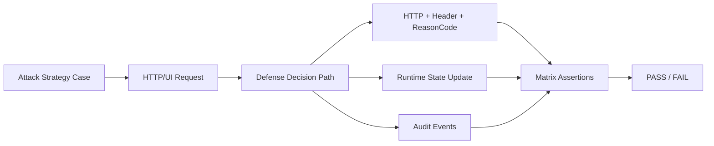

# Attack-Defense 정합성 매트릭스

## 1. 문서 목적과 범위
이 문서는 공격 전략과 방어 반응을 1:1로 매핑해, 계약 수준에서 검증 가능한 기준을 제공합니다. 목표는 “누가 맞다”가 아니라, 실행 결과가 설계 계약과 일치하는지 자동 검증 가능하게 만드는 것입니다.

```yaml
matrix_scope:
  objective:
    - "attack strategy to defense reaction traceability"
    - "protocol/state/audit contract verification"
  verification_axes:
    - http
    - headers
    - reason_code
    - state_transition
    - audit_events
  out_of_scope:
    - "manual ad-hoc interpretation"
    - "best-effort logging without assertions"
```

## 2. 시스템 경계와 컴포넌트
검증 대상은 Attack Agent와 Defense Runtime의 교차 지점입니다. 브라우저/백엔드 내부 구현보다, 계약 입력과 관측 출력의 정합성에 초점을 둡니다.

```yaml
boundary:
  attack_side:
    - "attack runner"
    - "challenge solver"
    - "response interpreter"
  defense_side:
    - "envoy/ext_authz"
    - "authz adapter"
    - "ai defense evaluate/challenge"
    - "runtime state store"
  observation_points:
    - "attack audit log"
    - "defense decision_audit"
    - "http response stream"
```

## 3. 전체 워크플로우
정합성 검증은 “공격 시도 → 방어 판단 → 상태 반영 → 로그 검증” 사이클로 수행합니다. 실패 케이스도 동일한 검증 파이프를 사용합니다.



```yaml
workflow_steps:
  - "select matrix row(strategy)"
  - "execute attack case"
  - "collect response/state/audit"
  - "apply row assertions"
  - "emit pass/fail with diff"
```

## 4. 상태머신
정합성 검증은 상태 전이가 기대 경로를 따르는지 확인해야 의미가 있습니다. 최소 검증 단위는 `from_state`, `event`, `to_state` 3요소입니다.

```yaml
state_validation:
  state_enum: [S0, S1, S2, S3, S4, S5, S6, SX]
  required_fields:
    - from_state
    - trigger_event
    - to_state
  critical_invariants:
    - "S3 gate blocks S4/S5 when not passed"
    - "S6 allows no new friction except BLOCK"
    - "SX is terminal (no further transition)"
```

## 5. 의사결정 엔진 정합성 매핑
공격 입력이 들어왔을 때 방어 엔진의 선택이 계약과 맞아야 합니다. 여기서는 Planner/Orchestrator 결과를 외부 관측값으로 검증합니다.

```yaml
decision_mapping:
  - attack_signal: "normal_human_like"
    expected_tier: "T0|T1"
    expected_action: "NONE|THROTTLE"
  - attack_signal: "repetitive_scan_pattern"
    expected_tier: "T1|T2"
    expected_action: "THROTTLE"
  - attack_signal: "vqa_not_passed_on_high_value_path"
    expected_action: "REQUIRE_S3"
    expected_reason_code: "CHALLENGE_REQUIRED"
  - attack_signal: "challenge_fail_threshold_exceeded"
    expected_tier: "T3"
    expected_action: "BLOCK"
```

## 6. 실행 액션 정합성 매핑
액션은 집행 지점까지 포함해 검증해야 합니다. THROTTLE은 allow+delay, REQUIRE_S3/BLOCK은 deny 응답으로 분기되는지 확인합니다.

```yaml
action_enforcement_mapping:
  NONE:
    expect_allow: true
    expect_delay_ms: 0
  THROTTLE:
    expect_allow: true
    expect_delay_ms: ">= configured threshold"
    expect_header: "x-defense-throttle-ms"
  REQUIRE_S3:
    expect_allow: false
    expect_http: 428
    expect_reason_code: CHALLENGE_REQUIRED
  BLOCK:
    expect_allow: false
    expect_http: 403
    expect_reason_code: BLOCKED
```

## 7. 프로토콜/인터페이스 계약 검증
응답 파싱과 정책 해석은 프로토콜 계약으로 검증합니다. 단일 값이 아니라 `HTTP + reasonCode + x-defense-*` 조합으로 assert 합니다.

```yaml
protocol_assertions:
  required_headers:
    - x-defense-action
    - x-defense-tier
    - x-defense-policy-version
  response_classification:
    blocked:
      any_of:
        - "http == 403"
        - "reasonCode == BLOCKED"
    challenge_required:
      any_of:
        - "http == 428"
        - "reasonCode == CHALLENGE_REQUIRED"
  evaluate_contract:
    endpoint: /evaluate
    required_response_fields:
      - allow
      - action
      - headers_to_add
```

## 8. 데이터/저장소 아키텍처 정합성
온라인/오프라인 저장소 책임이 섞이면 원인 추적이 불가능해집니다. 저장소별 데이터 유형이 계획대로 분리되었는지 확인합니다.

```yaml
storage_consistency_checks:
  redis:
    must_contain:
      - runtime_session_state
      - challenge_runtime_state
      - dedupe_ttl_keys
  s3:
    must_contain:
      - decision_audit_jsonl_raw
      - trajectory_raw_jsonl_raw
  postgresql:
    must_contain:
      - session_aggregates
      - policy_patch_history
      - reporting_views
  anti_pattern:
    - "raw trajectory only in redis"
    - "analytics-only fields mixed into runtime keys"
```

## 9. 로그/관측성 검증
매트릭스 판정은 로그 완결성에 의존합니다. 로그에 필수 필드가 누락되면 해당 케이스는 Fail이 아니라 Invalid로 분류합니다.

```yaml
observability_assertions:
  defense_audit_required_fields:
    - ts_ms
    - event_type
    - session_id
    - flow_state
    - action
    - policy_version
  attack_audit_required_fields:
    - ts_ms
    - event
    - flow_state
    - terminal_reason
  event_alignment:
    - "REQUIRE_S3 case -> challenge related audit exists"
    - "BLOCK case -> blocked audit exists"
    - "THROTTLE case -> throttle applied audit exists"
```

```jsonl
{"case_id":"MX-03","assert":"response_classification","http":428,"reasonCode":"CHALLENGE_REQUIRED","result":"PASS"}
{"case_id":"MX-03","assert":"state_transition","from_state":"S4","to_state":"S3","result":"PASS"}
{"case_id":"MX-03","assert":"audit_event","required":"S3_CHALLENGE_RESULT","found":true,"result":"PASS"}
```

## 10. 실패 처리와 가드레일 검증
실패 처리 검증은 보안 강도와 사용자 경험의 균형을 확인하는 단계입니다. 특히 무한 재시도, 종단 후 재진입, S6 마찰 삽입은 반드시 차단해야 합니다.

VQA 관련 정합성은 특히 "왜 실패했는지"를 분리해서 봐야 합니다.  
`428 CHALLENGE_REQUIRED`는 S3 미통과 회귀이고, `403 BLOCKED`는 정책상 차단이며, `503 CHALLENGE_VERIFY_UNAVAILABLE`는 검증 경로 장애입니다. 이 세 가지를 같은 실패로 뭉치면 원인 분석이 불가능해집니다.

또한 verify unavailable 케이스는 정책 의미까지 검증해야 합니다. 기본값이 fail-close이면 세션은 S3에 남아야 하고, 실패 카운터가 무조건 증가하면 안 됩니다. 매트릭스에서는 HTTP 코드뿐 아니라 상태 변화와 audit 필드까지 함께 assert해야 합니다.

```yaml
guardrail_assertions:
  retry_control:
    - "challenge retry budget enforced"
    - "budget exhaustion leads to SX"
  terminal_control:
    - "no mutation after SX"
  payment_stage_control:
    - "no REQUIRE_S3 in S6"
    - "only NONE/BLOCK allowed in S6"
  failure_mode_control:
    - "adapter/ai timeout fallback is auditable"
    - "verify unavailable(503) is distinguishable from normal fail path"
```

## 11. 검증 시나리오
시나리오는 공격 전략 중심으로 설계하고, 각 시나리오마다 기대 HTTP/헤더/상태/로그를 동시에 고정합니다.

```yaml
matrix_cases:
  - id: MX-01
    strategy: api_fast
    challenge_mode: pass
    expect:
      final_terminal: DONE
      must_not_have_reason: BLOCKED
  - id: MX-02
    strategy: token_tamper
    challenge_mode: fail
    expect:
      final_terminal: BLOCKED
      response_reason: BLOCKED
  - id: MX-03
    strategy: timing_fail
    challenge_mode: fail
    expect:
      response_reason_in: [CHALLENGE_REQUIRED, BLOCKED]
      challenge_attempt_events: ">=1"
  - id: MX-04
    strategy: ui_solver
    challenge_mode: pass
    expect:
      challenge_passed_event: true
      flow_recovery_from_s3: true
  - id: MX-05
    strategy: repetitive_scan_profile
    challenge_mode: auto
    expect:
      observed_action_in: [THROTTLE, REQUIRE_S3, BLOCK]
      tier_not_less_than: T1
  - id: MX-06
    strategy: verifier_unavailable_simulation
    challenge_mode: auto
    expect:
      response_reason: CHALLENGE_VERIFY_UNAVAILABLE
      response_http: 503
      flow_state_remains: S3
```

## 12. 운영 체크리스트
매트릭스 결과를 릴리즈 게이트로 쓰려면 실행 전후 체크를 표준화해야 합니다. 데이터 수집 실패나 환경 오염 상태에서는 결과를 승인 판단에 사용하지 않습니다.

```yaml
ops_checklist:
  pre_validation:
    - "attack and defense configs pinned"
    - "clock and timezone consistency ensured"
    - "log sinks writable and empty-window defined"
    - "required services healthy (ingress/envoy/adapter/ai/backend)"
  post_validation:
    - "all matrix rows executed"
    - "invalid rows reviewed separately"
    - "pass/fail report generated with diffs"
    - "artifacts archived (response traces + logs + summary)"
  release_gate:
    - "critical rows pass 100%"
    - "no contract regression on HTTP/header/state/audit"
```

## 13. 통합 테스트 실행 방법 (0/1/2)
정합성 매트릭스는 실제 실행 로그를 근거로 판정합니다. 따라서 서버 기동 -> 수동 baseline -> 공격 실행 순서를 고정합니다.

### 0. 전체 켜야하는 서버 명령어

```bash
# (A) Backend
cd /Users/jangjihyeon/201-goormgb-ai/platform/backend
./gradlew bootRun --console=plain
```

```bash
# (B) Envoy + Adapter + AI Defense
cd /Users/jangjihyeon/201-goormgb-ai/pilot/istio_adapter_local
docker-compose up -d --build
```

```bash
# (C) Frontend (Envoy 경유)
cd /Users/jangjihyeon/201-goormgb-ai/platform/frontend
TM_API_PROXY_TARGET=http://localhost:10000 npm run dev
```

```bash
# (D) health check
curl -sS http://localhost:8000/healthz
curl -sS http://localhost:9001/healthz
curl -sS http://localhost:9901/server_info
```

### 1. 직접 유저 테스트
정상 사용자 시나리오를 먼저 실행해 baseline 로그를 확보합니다.

```yaml
manual_baseline_for_matrix:
  objective: "공격 대비 baseline 비교군 확보"
  steps:
    - "직접 예매 플로우 1회 성공(DONE) 수행"
    - "S3 challenge pass 경로 확인"
  required_artifacts:
    - "logs/decision_audit.jsonl (baseline trace)"
    - "브라우저 네트워크 응답(403/428 없음 확인)"
```

### 2. 공격 에이전트 테스트
전략별 케이스를 실행하고 매트릭스 행(assert)와 1:1로 대조합니다.

```bash
# (A) 공격 에이전트 단일 시나리오
cd /Users/jangjihyeon/201-goormgb-ai
source .venv/bin/activate
TM_FRONTEND_URL=http://localhost:3000 \
python -m traffic_master_ai.attack.a1_mvp.main \
  --mode MAP --challenge-mode fail --challenge-strategy timing_fail
```

```bash
# (B) 공격 전략 매트릭스 일괄 실행
cd /Users/jangjihyeon/201-goormgb-ai
source .venv/bin/activate
python scripts/step7_attack_mode_matrix.py --frontend-url http://localhost:3000 --execute
```

```yaml
matrix_evidence_bundle:
  required:
    - "logs/attack_mvp/*.jsonl"
    - "logs/step7_attack_matrix_summary.json"
    - "logs/decision_audit.jsonl"
  assert_targets:
    - "HTTP status/reasonCode mapping"
    - "x-defense-* header consistency"
    - "state transition invariants"
    - "mandatory audit event presence"
```
