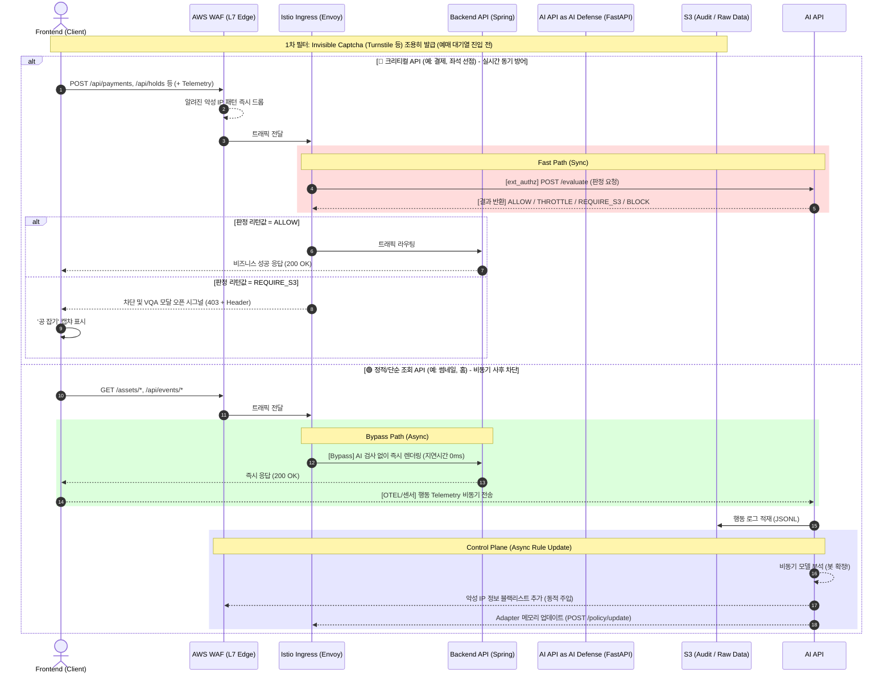
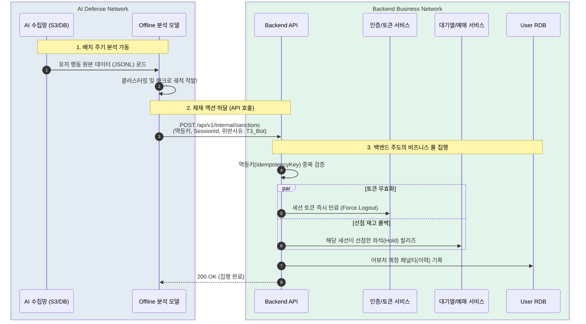

# Traffic Master - Option 6 하이브리드 아키텍처 명세서 (To-BE)

## 1. 문서 목적과 범위

본 문서는 티켓팅 및 트래픽 제어 시스템(Traffic Master)에서 발견되는 고도화된 봇 및 AI 에이전트를 방어하기 위한 **"Option 6 하이브리드 아키텍처"** 설계안입니다.
AI Defense 모델을 기반으로 한 실시간 차단 및 사후 제재의 기술적 근거를 제시하고, 백엔드(BE) 및 클라우드(Infra) 팀과의 명확한 협업 인터페이스 계약을 정의합니다.

### ❓ 왜 티켓팅 도메인에서 "실시간 차단"이 필수적인가?

- **Inventory Hoarding (재고 선점) 방지:** 티켓팅은 특정 시간(오픈 시점)에 트래픽이 집중되며, 봇이 한 번 좌석을 잡으면 결제 전이라도 일정 시간 좌석이 잠깁니다. 사후 분석으로 10분 뒤에 계정을 정지해도 이미 티켓은 선점되어 일반 유저는 티켓을 구매할 수 없습니다.
- **선의의 피해자 보호:** 선착순 시스템에서는 밀리초(ms) 단위의 봇 개입을 **실시간(망 진입 단계)**에서 VQA(캡챠)나 Rate Limit으로 지연(Throttle)/차단해야만 공정한 기회를 보장받을 수 있습니다.

### ❓ 1.1 기술적 당위성: 왜 백엔드가 아닌 독립 프록시(Envoy ext_authz)인가?

단순히 백엔드 API 서버(Spring Boot) 내부에 필터(Filter)나 인터셉터로 차단 로직을 포함시키지 않고, **독립된 Envoy ext_authz 프록시 계층을 배치하는 기술적/아키텍처적 필수 이유**는 다음과 같습니다.

1. **공통 정책 집행 지점(PEP)의 일원화 및 관심사 분리**
    - **설명:** Envoy는 단순히 AI를 호출하기 위한 어댑터가 아니라, 마이크로서비스 환경에서 비즈니스 로직과 무관하게 보안 정책을 일관되게 집행하는 **PEP(Policy Enforcement Point)** 역할을 수행합니다.
    - **장점:** 백엔드 도메인 코드(Java)에 방어 로직을 섞지 않음으로써, AI 모델(Python)의 잦은 피처 업데이트나 룰셋 변경이 백엔드 배포 사이클에 아무런 영향을 주지 않는 완벽한 관심사 분리(Decoupling)를 달성합니다.
2. **L7 애플리케이션 계층 조기 차단 (Fail-Fast at Edge)**
    - **설명:** 대규모 볼류메트릭 공격(L3/L4)은 앞단의 WAF나 CDN이 담당하지만, 이를 뚫고 들어오는 '정상인 척하는 악성 행위'는 애플리케이션 계층(L7)에서 막아야 합니다.
    - **장점:** 무거운 JVM 기반의 백엔드 서버가 커넥션을 맺고 쓰레드를 할당하기 전에, 앞단의 경량 프록시(Envoy + Go Adapter) 구조에서 조기 거절(Reject)함으로써 백엔드 본 서버의 리소스 고갈을 원천 방지합니다.
3. **분산 환경에서의 일관된 정책 적용**
    - **설명:** 백엔드 클러스터 내부에서 동적 Rate Limit이나 세션 기반 차단 상태를 수십 대의 애플리케이션 Pod가 실시간으로 동기화하는 구조는 비효율적입니다.
    - **장점:** 마이크로서비스 앞단에 배치된 Envoy 데이터 플레인들이 Redis와 결합하여, 정책 관리는 중앙(Control Plane)에서 하되 실제 차단 집행은 각 프록시에서 분산 처리함으로써 병목 없이 일관된 방어를 강제할 수 있습니다.

> **💡 핵심 요약 (아키텍처 비전)**
우리는 Envoy를 AI 연동용 도구로 쓰는 것이 아닙니다. 트래픽 관문에서 실시간 방어망(차단/스로틀/VQA 게이트)을 제어하는 **PEP(정책 집행 지점)**로 활용하며, 단순 인프라 공격은 WAF에서, 애플리케이션 악성 행위 선차단은 Envoy에서, 사후 비즈니스 제재는 BE로 각 계층의 역할을 명확히 분리(Defense in Depth)하는 구조입니다.
> 

---

## 2. As-Is 요약과 한계

| 구분 | As-Is (파일럿 1차) | 한계 및 문제점 |
| --- | --- | --- |
| **검증/권한** | Envoy ext_authz → Adapter → AI 단일 경로 | "왜 꼭 실시간으로 다 막아야 하나?"에 대한 설득력 부족, 오탐(False Positive) 시 운영자 개입 불가 |
| **제재 연동** | AI Defense가 트래픽만 차단하고 끝남 | 이미 악성 판정받은 유저의 계정 정지, 토큰 만료 등 BE 단의 비즈니스적 제재가 안 됨 |
| **운영 도구** | 블랙/화이트리스트 수동 관리 부재 | 운영자가 특정 IP 대역이나 악성 유저를 즉각적으로 차단/해제할 관제 인터페이스 없음 |
| **인프라 제어** | Istio 레벨만 활용, WAF/VPC 무관 | 대량의 단순 L7 공격 시 AI 서버까지 트래픽이 도달하여 컴퓨팅 리소스 및 API 비용 낭비 |

---

## 3. To-Be Option 6 하이브리드 아키텍처 핵심

**하이브리드(실시간 판단 + 사후 최적화 및 제재) 아키텍처**는 시스템의 성능, 가용성, 그리고 보안을 매끄럽게 결합합니다.

- **실시간(Runtime):** Envoy의 ext_authz를 사용하여 AI Defense API가 초저지연(ms)으로 트래픽을 허용(ALLOW), 보류(REQUIRE_S3), 제한(THROTTLE), 차단(BLOCK)합니다. LLM은 실시간 경로에 개입하지 않습니다.
- **사후(Offline):** S3에 수집된 로우 데이터(JSONL)를 통해 Offline LLM이 룰셋(패턴)을 파인튜닝하고 정책을 최적화합니다.
- **제어 평면(Control Plane):** AI가 명백한 봇으로 확정한 대상(IP/Token)을 BE(제재 API) 및 운영 정책(WAF, Istio Authz Policy) 측에 비동기로 전파하여 인프라/애플리케이션 계층 양쪽에서 락(Lock)을 겁니다.

---

## 4. 전체 워크플로우



### A. 전체 요청 라우팅 및 하이브리드 방어 경로 (Targeted Hybrid)

프론트엔드(FE)는 판단 권한이 없는 순수 신호 전달자(Sensor) 역할을 수행합니다. 모든 차단/제어 판단은 서버 권한 경계 내에서 이뤄집니다.

```
                           [ Frontend / Client ]
                                     │ (1) 사용자 액션 + Telemetry (X-Session-Id, x-captcha-token 등)
                                     ▼
                          [ WAF / Cloudflare (L7 Edge) ] ──(알려진 봇/IP 즉시 컷)──> [ Drop ]
                                     │ (2) 정상 트래픽 패스
                                     ▼
                       [ Istio Ingress / Envoy (App Edge) ]
                                     │
           =================( Envoy 라우팅 룰 분기 )=================
           │                                                        │
   [ 🔴 크리티컬 API 요청 ]                                [ 🟢 정적 자원 / 단순 조회 ]
   (예: /payments, /tickets)                             (예: /assets, /events/list)
           │                                                        │
           ▼                                                        ▼
[ 3-a. ext_authz 동기 검사 ]                                [ 3-b. 검사 생략 (Bypass) ]
[ Authz Adapter (Go) ]                                              │
           │ (4) POST /evaluate                                     │
           ▼                                                        │
[ AI Defense API (FastAPI) ]                                        │
           │ (5) 빠른 룰셋 & 행동 채점                                │
           ╰──> 결과: ALLOW / REQUIRE_S3 / BLOCK                     │
           │                                                        │
           ▼                                                        │
(ALLOW 인 경우)                                                     │
           │                                                        │
           ╰─────────────────────────┬──────────────────────────────╯
                                     │ (6) 트래픽 전달
                                     ▼
                        [ Backend API (Spring Boot) ]
                                     │ (7) 비즈니스 로직 처리 (DB 등)
                                     ▼
                          [ Response (200 OK) ]
```

### D. 사후분석/Offline LLM 최적화 루프

```
[ AI Defense API ] ──(비동기 JSONL 쓰기)──> [ Audit Logger ]
                                               │
                                               ▼
[ S3 (Object Storage) ] <──(일 배치 / 스케줄 기반 크론)── [ Offline LLM Worker ]
   │                                              │ (1) JSONL Raw 분석
   │                                              │ (2) 새로운 공격 패턴/신규 룰 발굴
   │ (ETL 배치)                                    ▼
   ▼                                       [ Policy Store (DB / Git) ]
[ PostgreSQL (Analytics) ]                        │ (3) 룰셋 업데이트
                                                  ▼
                                           [ AI Defense API (Runtime) ]
```

---

## 5. 상태 머신 및 액션 모델

### 흐름 상태 (Flow State: S0 ~ S6, SX)

- `S0~S5`: 진입, 상품조회, 대기열, 옵션선택 등 결제 이전 단계. 마찰(Friction, ex: VQA) 추가 가능.
- `S6`: 결제/인증 단계. **(제약사항: S6에서는 새로운 마찰 추가 불가, 명백하면 BLOCK, 애매하면 우선 ALLOW).**
- `SX`: 최종 차단/세션 파기 상태.

### 방어 액션 (Defense Action Enum)

- `NONE`: 정상. BE로 바로 트래픽 통과.
- `THROTTLE`: 동적 Rate Limit 지연 주입.
- `REQUIRE_S3`: VQA(공 잡기 등 캡챠 로직) 통과 전까지 API 처리 보류.
- `BLOCK`: Envoy 단에서 403 Forbidden 반환하여 BE 도달 원천 차단.

---

## 6. 인터페이스 계약

### 6.1. AI -> BE Sanctions API (제재 전달)

AI Defense가 봇으로 확정한 트래픽에 대응하는 "사용자/토큰 정지" 처리를 위해 Backend에 호출.

```json
// POST /api/v1/internal/sanctions
// Authorization: Bearer {TM_ADMIN_SHARED_TOKEN}
{
  "idempotencyKey": "uuid-v4-string",
  "sessionId": "tm:sess:abc1234",
  "target": {
    "type": "USER_TOKEN",  // "USER_TOKEN" | "ACCOUNT_ID" | "SESSION"
    "value": "idx_user_9912"
  },
  "action": "SUSPEND", // "SUSPEND" | "RATE_LIMIT" | "FORCE_LOGOUT"
  "reasonCode": "R2_CHALLENGE_FAIL_THRESHOLD",
  "auditTraceId": "trace-991823"
}
```

### 6.2. AI -> Authz-Adapter Policy API

```json
// POST /policy/update
{
  "blockIps": ["192.168.1.1/32"],
  "tierThresholdOverrides": {
    "T2": 0.65
  }
}
```

Istio 내부 정책 엔진이나 Adapter의 캐시를 즉시 갱신하기 위한 API.

### 6.3. Envoy -> Frontend 반환 헤더 규약 (Client가 인식)

Envoy ext_authz가 거부 시(403 반환 시), 클라이언트 프론트엔드가 상태를 인식할 헤더 체계:

- `x-defense-action`: "BLOCK" | "CHALLENGE"
- `x-defense-tier`: "T3"
- `x-defense-reason`: "MOUSEDYNAMICS_INVALID"

### 6.4. Frontend -> Envoy/AI Defense (Telemetry 전송 규약)

프론트엔드에서 수집한 텔레메트리 데이터는 **실시간 동기 검사용(Fast Path)**과 **비동기 사후 수집용(Bypass Path)**의 두 가지 형태로 분리되어 전송됩니다. 프록시(Envoy) 파싱 성능 최적화 및 백엔드 비즈니스 로직 오염 방지를 위해, 실시간 판단용은 헤더(Header)를 사용하고 비동기 수집용은 바디(Body)를 사용합니다.

#### 1) 🔴 실시간 동기 분석 (Fast Path) - Header 전송
결제/예매 등 크리티컬 API 요청 시, 순수 요약 피처를 **HTTP Header**에 포함하여 전송합니다. Envoy가 이를 가로채 AI에 동기 검사를 요청합니다.

- **전송 대상 API:** `POST /api/payments`, `POST /api/holds` 등 크리티컬 비즈니스 API
- **전송 위치:** `x-defense-features` 헤더 (문자열)
- **페이로드 스키마 (Core Features 8종):**
  ```json
  {
    "totalDist": 950.5,
    "linearDist": 850.2,
    "linearityRatio": 0.89,
    "avgVelocity": 580.0,
    "tremorStdDev": 2.4,
    "dwellTime": 1200.0,
    "moveEventCount": 45,
    "segmentDurationMs": 2100
  }
  ```

#### 2) 🟢 비동기 사후 수집 (Bypass Path) - Body 전송
유저 행동 원본 데이터를 백그라운드에서 오프라인 AI 학습/분석용으로 대량 전송합니다. Envoy는 이 텔레메트리 요청을 백엔드로 보내지 않고 **AI 전용 수집 API(AI Defense Network)** 쪽으로 즉시 라우팅 처리하여 타 서버의 부하를 0으로 만듭니다.

- **전송 대상 API:** `POST /api/telemetry/behavior` (Envoy에서 AI 수집 API로 라우팅 직행)
- **전송 위치:** HTTP **Body**
- **페이로드 스키마 (Core + Shadow + Raw Points):**
  ```json
  {
    "sessionId": "tm:sess:abc1234",
    "trigger": "PAGE_LEAVE",
    "features": {
      "totalDist": 950.5,
      "linearDist": 850.2,
      "linearityRatio": 0.89,
      "avgVelocity": 580.0,
      "tremorStdDev": 2.4,
      "dwellTime": 1200.0,
      "moveEventCount": 45,
      "segmentDurationMs": 2100,
      "keyDownCount": 5,
      "keyHoldAvgMs": 120.5,
      "keyIntervalCv": 0.15,
      "backspaceCount": 0,
      "pasteDetected": false,
      "imeCompositionCount": 0,
      "timestamp": 1741680000000
    },
    "points": [
      {"x": 150, "y": 300, "t": 0},
      {"x": 152, "y": 305, "t": 10},
      {"x": 155, "y": 312, "t": 25}
    ]
  }
  ```

---

## 7. 데이터/저장소 책임

1. **Redis (Runtime)**
    - 소유: AI Defense
    - 목적: 초저지연 세션 윈도우 관리, 리스크 점수 누적 합산. `tm:sess:{sessionId}`. (TTL 1~30분)
2. **Object Storage (S3 등)**
    - 소유: Cloud/Data 팀 프로비저닝, AI 팀 쓰기
    - 목적: Audit 로그 및 Trajectory(마우스/키보드 RAW) 원본 보관소. Append-only, 규제 준수 아카이브.
3. **PostgreSQL (Analytics JSONB)**
    - 소유: Data/Backend 팀
    - 목적: S3 데이터를 ETL로 정제하여 적재. 운영자 백오피스 관제(대시보드 KPI) 조회를 위한 RDB 질의용.

---

## 8. 관측성/감사

- **추적 키:** `x-correlation-id` (Envoy가 최초 진입 시 부여)를 FE, AI, BE 전체가 공유.
- **decision_audit:** 요청당 판정 근거 (risk_score, action, hit_rules) 기록.
- **trajectory_raw:** (샘플링 기반) 이상 유저 마우스 궤적 RAW 데이터 적재.
- **KPI 메트릭:** `ai_defense_evaluate_total{decision="..."}` 포맷의 Prometheus 메트릭으로 시각화.

---

## 9. 실패 처리와 가드레일 (Resiliency)

- **Envoy ↔ AI Defense 통신 장애 (gRPC/HTTP Timeout):**
    - 기본 정책: **Fail-Open (허용)**. AI 서버 장애로 인한 정상 유저 티켓 구매 불가(장애 전이)는 최악의 시나리오. (단순 DDoS 시 BE 인프라 Auto Scale 아웃으로 대응)
    - 단, 결제 API(`S6` 관련) 같은 고위험 구간은 부분적으로 **Fail-Close** 적용 검토.
- **Verify Unavailable (VQA 시스템 다운):**
    - 캡챠 서버 미작동 시, "REQUIRE_S3" 액션은 강제로 "ALLOW + THROTTLE"로 다운그레이드. (관련 설정: `TM_S3_VERIFY_UNAVAILABLE_MODE=fail_open`)
- **멱등성(Idempotency):**
    - Sanctions API 호출 시 네트워크 오류가 났을 경우 재시도를 위해 `idempotencyKey` 필드 필수 확인.

---

## 10. 운영 모델 & 정책 반영 경로

운영자가 대시보드(BE 제공 백오피스)에서 "특정 대역 차단"을 결정할 경우의 흐름입니다.

### C. 운영자 제어 -> Istio/VPC/WAF 제어 경로 (Control Plane)

```
[ Admin Console (Backend 백오피스) ]
   │ (1) "공격자 IP 대역 1.1.1.0/24 전면 차단 승인"
   ▼
[ Backend (Spring Boot) ] ── (2) API (인증/권한 확인) ──┐
   │                                                 │
   ▼ (Webhook / API)                                  ▼
[ IaC Controller / Terraform Cloud ]            [ Authz Adapter ]
   │                                                 │
   ▼ (3-a) Global 인프라 갱신                           ▼ (3-b) Local 캐시 갱신
[ AWS WAF / Cloudflare ]                        [ Envoy Data Plane ]
```

### B. AI -> BE 제재(Sanctions) 전달 경로 (Asynchronous - 관심사 분리)

오프라인 AI 단에서 매크로 유저가 확정되었을 때, 이를 백엔드 비즈니스 로직에 반영하기 위한 규약입니다. AI 팀은 "의심 유저 판정 및 제재 API 호출"까지만 담당하며, "실제 토큰 만료 및 좌석 롤백 처리"는 백엔드의 고유 권한(비즈니스 룰)으로 집행합니다.



*(MVP 단계에서는 큐 오버헤드를 줄이기 위해 위 다이어그램과 같이 내부 API `POST /api/v1/internal/sanctions` 직결 통신으로 갈음할 수 있습니다.)*

---

## 11. 백엔드 협업안 (1차 합의용)

백엔드팀 요구사항에 대한 답변 및 합의안입니다.

1. **사후처리 실행 방식 (스케줄러 vs 배치)**
    - **결론:** S3의 Raw Data를 PostgreSQL로 퍼오는 ETL은 **스케줄러 주도(ChronJob 형태의 단기 배치)**를 권장합니다 (1시간~1일 1회). 실시간성이 불필요한 관제 목적이기 때문입니다.
2. **AI → BE 전달 방식 (제재/Sanctions)**
    - **1차안(MVP):** 단순 **REST API (Sync/Async)**. AI Defense에서 BE 내부망 API를 멱등키를 포함해 호출. 인프라 복잡성(Kafka 도입) 회피.
    - **2차안(Prod):** Kafka Event Sourcing. AI팀이 `bot_detected` 토픽에 이벤트만 발행, BE가 폴링 처리. (Phase 3에서 도입 검토)
3. **악성/어뷰저 토큰 제한 방식**
    - AI팀은 대상자(세션ID, 식별가능한 User Key)만 넘깁니다. 토큰을 찢을지(Revoke), 계정을 영구 정지할지는 전적으로 BE 비즈니스 티어에서 정책화(Policy)합니다.

---

## 12. 단계별 도입 계획

- **Phase 1 (MVP/Pilot):** 실시간 경로 완전 구축. (WAF 미연동, 제재는 AI Defense 레벨에서 세션만 차단, BE 연동 생략)
    - *Risk:* 봇 통과 시 BE에서 처리 불가. *Mitigation:* VQA 테스트 집중.
- **Phase 2 (Staging/Data Pipeline):** S3 로깅 및 PostgreSQL ETL 도입. AI -> BE Sanction REST API 기초 연동. (운영자 백오피스 기초 시각화 가능)
- **Phase 3 (Production):** WAF 제어평면 연동, Kafka 도입, Offline LLM 최적화 루프 가동. 만약 문제 발생 시, Istio ext_authz 설정을 `Disable` 하여 즉시 롤백.

---

## 13. 열린 이슈 (의사결정 필요 항목)

- **Q1.** BE 팀의 Sanctions API(`/api/v1/internal/sanctions`) 스펙은 위 JSON 계약으로 갈음해도 충분한지? Auth 헤더 형식은 BE 컨벤션을 따를 것인지?
- **Q2.** Cloud 팀에게 AWS WAF 등의 External FW 적용 시, AI 팀이 차단 대상 IP 목록을 전달할 주기와 방식(예: S3 Blacklist 덤프 후 Terraform 반영 vs Lambda 연동 자동화) 결정 필요.
- **Q3.** `TM_S3_VERIFY_UNAVAILABLE_MODE=fail_open` 정책 동의 여부. (가용성 vs 방어력)

---

## 14. 실무 실행 (Next Actions)

| 팀 | 담당 작업 (TODO) | 연관 문서 / Phase |
| --- | --- | --- |
| **AI 팀** | AI Defense API에 BE Sanctions 호출 클라이언트 로직 추가 (1차 API 방식) | 계약 6.1 (Phase 2) |
| **Backend 팀** | `/api/v1/internal/sanctions` 엔드포인트 구현 (토큰 무효화 비즈니스 로직 작성) | 계약 6.1 (Phase 2) |
| **AI 팀** | Frontend가 쏘는 행동 텔레메트리를 직접 수집하여 S3 및 DB 적재소에 넘기는 전용 API 구현 | 계약 6.4 (Phase 1) |
| **Cloud 팀** | Istio `AuthorizationPolicy` / `EnvoyFilter` 설정 시 timeout 100ms 파라미터 적용 (fail-open) | 계약 9 (Phase 1) |
| **Cloud 팀** | S3 버킷 권한(IAM 등) AI팀 제공, PgSQL 인스턴스 정보 BE/Data팀 제공 | 계약 7 (Phase 2) |
| **Frontend 팀** | (AI팀 지원 하에) ext_authz 차단 403 / 특수 Header 발생 시 캡챠 모달 연동 | 계약 6.3 (Phase 1) |